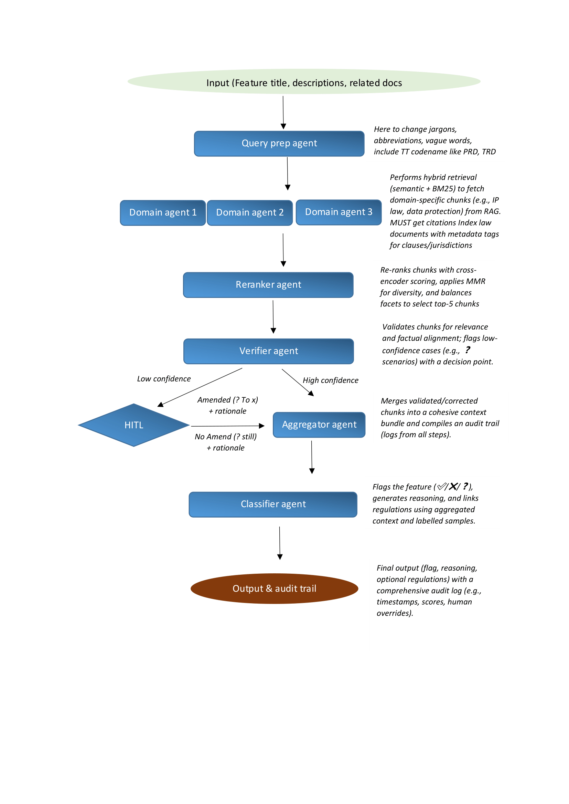

# GeoLogicClassifer123

# Demo
Find the demo using `openai/gpt-oss-20b` over at Hugging Face [here](https://huggingface.co/spaces/greenery-scenery/Geo-Compliance-Classifier). For `gpt-3.5-turbo` or other models, run code locally with OpenAI's key.

# From Guesswork to Governance — High-Level Agent Overview

## Pipeline (at a glance)
Query Prep → Domain Agents → Reranker → Verifier → (HITL if needed) → Aggregator → Classifier → Output & Audit

---

## 1) Query Prep Agent
**What:** Normalize feature artifacts and extract key signals.  

**Task:** Clean text, resolve codenames/jargon, detect intent & geo, add synonyms/triggers, emit an enriched query.

## 2) Domain Agents (xN)
**What:** Per-domain retrieval (e.g., youth safety, reporting/CSAM, EU DSA).  

**Task:** Pull top candidate law chunks with citations and jurisdiction tags using hybrid lexical+semantic search.

## 3) Reranker Agent
**What:** Advanced refinement layer for candidate chunks using hybrid scoring and diversity optimization.

**Task:** Re-rank the initial chunk set from the Domain Agent using a cross-encoder (e.g., ms-marco-MiniLM-L-6-v2) to compute pairwise query-chunk relevance scores, integrating these with weighted BM25 scores for lexical precision. Apply Maximal Marginal Relevance (MMR) with a tunable lambda (e.g., 0.7) to maximize diversity while preserving relevance, ensuring non-redundant coverage across domains and jurisdictions. Balance facets (e.g., legal domains like IP, Data Protection, or regions like EU, Brazil) using a weighted round-robin or clustering approach to select a top-5 subset. Log intermediate scores and diversity metrics for audit traceability.

## 4) Verifier Agent
**What:** Robust validation engine transforming raw text into legally grounded evidence with confidence assessment.

**Task:** Evaluate the reranked chunks for geo-context alignment (e.g., matching query region to chunk jurisdiction) and citation applicability (e.g., verifying cited clauses like GDPR Art. 5). Compute a composite confidence score (0-10) based on weighted components: relevance to query (40%), internal consistency across chunks (30%), citation quality (20%), and facet diversity (10%). Identify supporting snippets (e.g., matching regulations) and conflicting ones (e.g., contradictory geo-rules), flagging low-confidence cases (<7.0 threshold) for HITL with detailed rationale. Maintain an audit log of scores and validation steps.

## 5) HITL (Human-in-the-Loop)
**What:** Interactive expert review system for resolving complex or ambiguous cases with iterative feedback. 

**Task:** Present the query, top-5 chunks, confidence score, and detailed validation breakdown to a human reviewer. Offer a suggested label (**YES/NO/UNCERTAIN**) based on Verifier output, allowing overrides with custom flags and rationales. Support chunk modification (e.g., adding new evidence or editing content/citations) and capture metadata (e.g., reviewer ID, timestamp). Feed back corrections to update chunk sets and labelled samples, enabling dynamic learning, with logs for each intervention to ensure compliance traceability.

## 6) Aggregator Agent
**What:** Sophisticated context synthesizer and audit consolidator for downstream classification.  

**Task:** Merge the verified or HITL-updated chunks into a cohesive context bundle, deduplicating citations and resolving conflicts via a priority rule (e.g., latest regulation). Balance facets by optimizing representation across jurisdictions and domains using a weighted scoring model (e.g., prioritizing underrepresented regions), ensuring a compact yet comprehensive context. Compile a detailed audit trail integrating logs from prior agents (e.g., scores, HITL overrides) with timestamps and metadata, preparing a structured input for the Classifier.

## 7) Classifier Agent
**What:** Decision engine generating triage labels with comprehensive traceability and self-assessment.

**Task:** Analyze the aggregated context and query to output a final flag (**YES/NO/UNCERTAIN**) using a few-shot learning approach with labelled samples (e.g., past feature classifications). Generate a detailed reasoning statement, linking specific regulations and citation IDs from chunks, with cross-references to supporting evidence. Compute a self-confidence score (0-1) based on agreement with labelled samples and chunk consistency. Maintain an audit trail with decision rationale, regulation mappings, and confidence metrics, flagging edge cases for further review. 

## 8) Outputs & Audit Trail
**What:** Comprehensive submission artifacts and granular compliance evidence for regulatory scrutiny.

**Task:** Export decision outputs in structured CSV or JSONL format, including: feature ID, final flag, full reasoning text, linked regulation citations with clause numbers, sentence indices of supporting chunks, confidence scores, decision thresholds, and HITL override details. Include a detailed audit trail with timestamps, agent logs (e.g., Verifier scores, Classifier rationale), and provenance metadata (e.g., chunk sources, reviewer actions), ensuring full traceability and compliance with governance requirements.
