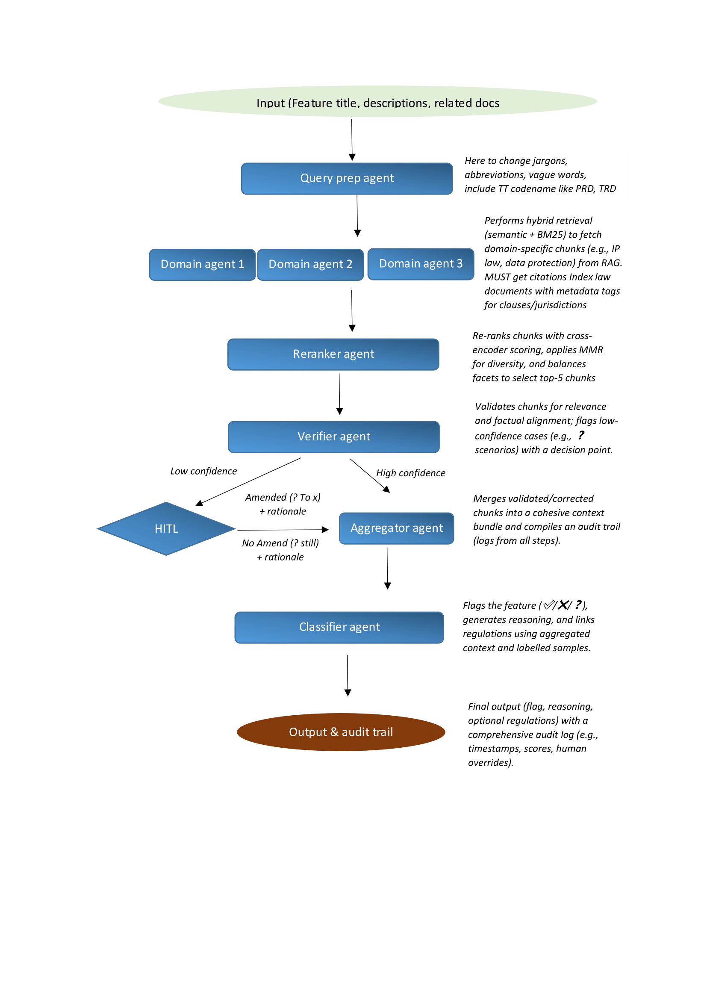

├── .DS_Store
├── .env
├── README.md
├── REPO_MAP.md
├── __pycache__
    └── config.cpython-310.pyc
├── agents
    ├── aggregator_agent.py
    ├── ai_governance_agent.py
    ├── base_agent.py
    ├── classifier_agent.py
    ├── consumer_protection_agent.py
    ├── content_moderation_agent.py
    ├── data_privacy_agent.py
    ├── hitl_agent.py
    ├── ip_protection_agent.py
    ├── reranker_agent.py
    ├── verifier_agent.py
    └── youth_safety_agent.py
├── assets
    └── agent_workflow.png
├── config.py
├── kb
    ├── consumer_protection
    │   └── EU_DSA_A25.txt
    ├── data_privacy
    │   ├── EU_GDPR_A5.txt
    │   ├── HK_PDPC_Part5.txt
    │   ├── HK_PDPC_Part6.txt
    │   ├── MY_PDPA_DIV1.txt
    │   ├── MY_PDPA_DIV3.txt
    │   ├── SG_PDPA.txt
    │   └── uae_pdpl_2021.txt
    └── youth_safety
    │   ├── AU_CWSA_2024
    │   ├── CA_SB976.txt
    │   ├── EU_DSA_A28.txt
    │   ├── FL_HB3.txt
    │   ├── INDIA_Juvenile_2015.txt
    │   └── uae_wadeema_2024.txt
├── pilot.py
└── utils
    ├── inputqueryenhancer.py
    ├── rag.py
    └── semanticchunker.py

/.DS_Store:
--------------------------------------------------------------------------------
https://raw.githubusercontent.com/finnerrrrr/Tiktok-Techjam-Geo-Compliance-Classifier-WalaWalaOokOok-/d13fa4fd42532500eab421bcafa0e1d2d11c18d9/.DS_Store

--------------------------------------------------------------------------------
/.env:
--------------------------------------------------------------------------------
1 | OPENAI_API_KEY="API KEY HERE"
2 | TF_ENABLE_ONEDNN_OPTS=0

--------------------------------------------------------------------------------
/README.md:
--------------------------------------------------------------------------------
 1 | 
 2 | # GeoLogicClassifer123
 3 | 
 4 | 
 5 | 
 6 | # Demo
 7 | Find the demo using `openai/gpt-oss-20b` over at Hugging Face [here](https://huggingface.co/spaces/greenery-scenery/Geo-Compliance-Classifier). For `gpt-3.5-turbo` or other models, run code locally with OpenAI's key.
 8 | 
 9 | # From Guesswork to Governance — High-Level Agent Overview
10 | 
11 | ## Pipeline (at a glance)
12 | Query Prep → Domain Agents → Reranker → Verifier → (HITL if needed) → Aggregator → Classifier → Output & Audit
13 | 
14 | ---
15 | 
16 | ## 1) Query Prep Agent
17 | **What:** Normalize feature artifacts and extract key signals.  
18 | 
19 | **Task:** Clean text, resolve codenames/jargon, detect intent & geo, add synonyms/triggers, emit an enriched query.
20 | 
21 | ## 2) Domain Agents (xN)
22 | **What:** Per-domain retrieval (e.g., youth safety, reporting/CSAM, EU DSA).  
23 | 
24 | **Task:** Pull top candidate law chunks with citations and jurisdiction tags using hybrid lexical+semantic search.
25 | 
26 | ## 3) Reranker Agent
27 | **What:** Advanced refinement layer for candidate chunks using hybrid scoring and diversity optimization.
28 | 
29 | **Task:** Re-rank the initial chunk set from the Domain Agent using a cross-encoder (e.g., ms-marco-MiniLM-L-6-v2) to compute pairwise query-chunk relevance scores, integrating these with weighted BM25 scores for lexical precision. Apply Maximal Marginal Relevance (MMR) with a tunable lambda (e.g., 0.7) to maximize diversity while preserving relevance, ensuring non-redundant coverage across domains and jurisdictions. Balance facets (e.g., legal domains like IP, Data Protection, or regions like EU, Brazil) using a weighted round-robin or clustering approach to select a top-5 subset. Log intermediate scores and diversity metrics for audit traceability.
30 | 
31 | ## 4) Verifier Agent
32 | **What:** Robust validation engine transforming raw text into legally grounded evidence with confidence assessment.
33 | 
34 | **Task:** Evaluate the reranked chunks for geo-context alignment (e.g., matching query region to chunk jurisdiction) and citation applicability (e.g., verifying cited clauses like GDPR Art. 5). Compute a composite confidence score (0-10) based on weighted components: relevance to query (40%), internal consistency across chunks (30%), citation quality (20%), and facet diversity (10%). Identify supporting snippets (e.g., matching regulations) and conflicting ones (e.g., contradictory geo-rules), flagging low-confidence cases (<7.0 threshold) for HITL with detailed rationale. Maintain an audit log of scores and validation steps.
35 | 
36 | ## 5) HITL (Human-in-the-Loop)
37 | **What:** Interactive expert review system for resolving complex or ambiguous cases with iterative feedback. 
38 | 
39 | **Task:** Present the query, top-5 chunks, confidence score, and detailed validation breakdown to a human reviewer. Offer a suggested label (**YES/NO/UNCERTAIN**) based on Verifier output, allowing overrides with custom flags and rationales. Support chunk modification (e.g., adding new evidence or editing content/citations) and capture metadata (e.g., reviewer ID, timestamp). Feed back corrections to update chunk sets and labelled samples, enabling dynamic learning, with logs for each intervention to ensure compliance traceability.
40 | 
41 | ## 6) Aggregator Agent
42 | **What:** Sophisticated context synthesizer and audit consolidator for downstream classification.  
43 | 
44 | **Task:** Merge the verified or HITL-updated chunks into a cohesive context bundle, deduplicating citations and resolving conflicts via a priority rule (e.g., latest regulation). Balance facets by optimizing representation across jurisdictions and domains using a weighted scoring model (e.g., prioritizing underrepresented regions), ensuring a compact yet comprehensive context. Compile a detailed audit trail integrating logs from prior agents (e.g., scores, HITL overrides) with timestamps and metadata, preparing a structured input for the Classifier.
45 | 
46 | ## 7) Classifier Agent
47 | **What:** Decision engine generating triage labels with comprehensive traceability and self-assessment.
48 | 
49 | **Task:** Analyze the aggregated context and query to output a final flag (**YES/NO/UNCERTAIN**) using a few-shot learning approach with labelled samples (e.g., past feature classifications). Generate a detailed reasoning statement, linking specific regulations and citation IDs from chunks, with cross-references to supporting evidence. Compute a self-confidence score (0-1) based on agreement with labelled samples and chunk consistency. Maintain an audit trail with decision rationale, regulation mappings, and confidence metrics, flagging edge cases for further review. 
50 | 
51 | ## 8) Outputs & Audit Trail
52 | **What:** Comprehensive submission artifacts and granular compliance evidence for regulatory scrutiny.
53 | 
54 | **Task:** Export decision outputs in structured CSV or JSONL format, including: feature ID, final flag, full reasoning text, linked regulation citations with clause numbers, sentence indices of supporting chunks, confidence scores, decision thresholds, and HITL override details. Include a detailed audit trail with timestamps, agent logs (e.g., Verifier scores, Classifier rationale), and provenance metadata (e.g., chunk sources, reviewer actions), ensuring full traceability and compliance with governance requirements.
55 | 

--------------------------------------------------------------------------------
/__pycache__/config.cpython-310.pyc:
--------------------------------------------------------------------------------
https://raw.githubusercontent.com/finnerrrrr/Tiktok-Techjam-Geo-Compliance-Classifier-WalaWalaOokOok-/d13fa4fd42532500eab421bcafa0e1d2d11c18d9/__pycache__/config.cpython-310.pyc

--------------------------------------------------------------------------------
/agents/aggregator_agent.py:
--------------------------------------------------------------------------------
 1 | class AggregatorAgent:
 2 |     def __init__(self):
 3 |         pass
 4 | 
 5 |     def process(self, chunks, hitl_feedback=None):
 6 |         """Aggregate chunks into a cohesive context bundle, incorporate HITL feedback"""
 7 |         aggregated = {
 8 |             'chunks': chunks,
 9 |             'summary': ' '.join([chunk['content'][:50] for chunk in chunks]),
10 |             'audit_trail': []
11 |         }
12 |         if hitl_feedback:
13 |             aggregated['hitl_override'] = {
14 |                 'flag': hitl_feedback.get('override_flag'),
15 |                 'rationale': hitl_feedback.get('override_rationale')
16 |             }
17 |             aggregated['chunks'] = hitl_feedback.get('updated_chunks', chunks)
18 |             aggregated['audit_trail'].append("HITL Override Applied")
19 | 
20 |         return aggregated
21 | 

--------------------------------------------------------------------------------
/agents/ai_governance_agent.py:
--------------------------------------------------------------------------------
1 | from .base_agent import BaseAgent
2 | 
3 | class AIGovernanceAgent(BaseAgent):
4 |     def __init__(self, vdb):
5 |         super().__init__("AI Governance Agent", vdb)

--------------------------------------------------------------------------------
/agents/base_agent.py:
--------------------------------------------------------------------------------
 1 | # agents/base_agent.py
 2 | from __future__ import annotations
 3 | 
 4 | from typing import Any, Dict, List
 5 | from pydantic import BaseModel, Field
 6 | import os, sys
 7 | 
 8 | # Make ../utils importable
 9 | sys.path.append(os.path.abspath(os.path.join(os.path.dirname(__file__), "..")))
10 | from utils.rag import RAGSearcher  # hybrid searcher (semantic + BM25)
11 | 
12 | 
13 | class RetrievedChunk(BaseModel):
14 |     """Single retrieval unit (matches rag.py output shape)."""
15 |     content: str = Field(description="Chunk text")
16 |     relevance_score: float = Field(description="0..10 hybrid score")
17 |     metadata: Dict[str, Any] = Field(
18 |         default_factory=dict,
19 |         description="Chunk metadata from the VDB (e.g., law, source, chunk_number, jurisdiction)"
20 |     )
21 | 
22 | 
23 | class BaseAgent:
24 |     """
25 |     Minimal domain agent:
26 |       • holds a domain-specific VDB
27 |       • runs hybrid RAG via RAGSearcher
28 |       • returns top-k chunks (no judgments)
29 |     """
30 | 
31 |     def __init__(self, name: str, vdb: Any, semantic_weight: float = 0.60, bm25_weight: float = 0.40):
32 |         """
33 |         Args:
34 |           name: Display name, e.g. "Youth Safety Agent"
35 |           vdb:  Duck-typed vector DB with:
36 |                 - chunks (list[dict|obj{content, metadata}])
37 |                 - embeddings (np.ndarray, L2-normalized)
38 |                 - bm25 (rank_bm25.BM25Okapi)
39 |                 - embedder or embedder_name (SentenceTransformer or str)
40 |         """
41 |         self.name = name
42 |         self.vdb = vdb
43 |         self.searcher = RAGSearcher(semantic_weight=semantic_weight, bm25_weight=bm25_weight)
44 | 
45 |     def analyze_feature(
46 |         self,
47 |         prepped_query: str | Dict[str, Any],
48 |         top_k: int = 5,
49 |         candidate_k_each: int = 50,
50 |     ) -> List[Dict[str, Any]]:
51 |         """
52 |         Perform hybrid retrieval and return k most relevant chunks.
53 | 
54 |         Returns a list of dicts (directly from RAGSearcher):
55 |           [
56 |             {"content": str, "relevance_score": float, "metadata": dict},
57 |             ...
58 |           ]
59 |         """
60 |         results = self.searcher.search(
61 |             vdb=self.vdb,
62 |             prepped_query=prepped_query,
63 |             top_k=top_k,
64 |             candidate_k_each=candidate_k_each,
65 |         )
66 |         return results

--------------------------------------------------------------------------------
/agents/classifier_agent.py:
--------------------------------------------------------------------------------
  1 | class ClassifierAgent:
  2 |     def __init__(self):
  3 |         self.labelled_samples = [
  4 |             {
  5 |                 "feature": "To comply with the Utah Social Media Regulation Act, we are implementing a curfew-based login restriction for users under 18. The system uses ASL to detect minor accounts and routes enforcement through GH to apply only within Utah boundaries. The feature activates during restricted night hours and logs activity using EchoTrace for auditability. This allows parental control to be enacted without user-facing alerts, operating in ShadowMode during initial rollout.",
  6 |                 "flag": "YES",
  7 |                 "reasoning": "Explicitly references Utah Social Media Regulation Act; geo-specific compliance logic required.",
  8 |                 "regulations": ["Utah Social Media Regulation Act"]
  9 |             },
 10 |             {
 11 |                 "feature": "As part of compliance with California’s SB976, the app will disable PF by default for users under 18 located in California. This default setting is considered NR to override, unless explicit parental opt-in is provided. Geo-detection is handled via GH, and rollout is monitored with FR logs. The design ensures minimal disruption while meeting the strict personalization requirements imposed by the law.",
 12 |                 "flag": "UNCERTAIN",
 13 |                 "reasoning": "No explicit regulation or clear legal obligation detected; needs human evaluation.",
 14 |                 "regulations": []
 15 |             },
 16 |             {
 17 |                 "feature": "In line with the US federal law requiring providers to report child sexual abuse content to NCMEC, this feature scans uploads and flags suspected materials tagged as T5. Once flagged, the CDS auto-generates reports and routes them via secure channel APIs. The logic runs in real-time, supports human validation, and logs detection metadata for internal audits. Regional thresholds are governed by LCP parameters in the backend.",
 18 |                 "flag": "YES",
 19 |                 "reasoning": "Explicitly references US NCMEC reporting requirements; geo-specific compliance logic required.",
 20 |                 "regulations": ["US NCMEC reporting requirements"]
 21 |             },
 22 |             {
 23 |                 "feature": "To meet the transparency expectations of the EU Digital Services Act, we are introducing a visibility lock for flagged user-generated content labeled under NSP. When such content is detected, a soft Softblock is applied and GH ensures enforcement is restricted to the EU region only. EchoTrace supports traceability, and Redline status can be triggered for legal review. This feature enhances accountability and complies with Article 16’s removal mechanisms.",
 24 |                 "flag": "YES",
 25 |                 "reasoning": "Explicitly references EU Digital Services Act (DSA); geo-specific compliance logic required.",
 26 |                 "regulations": ["EU Digital Services Act (DSA)"]
 27 |             },
 28 |             {
 29 |                 "feature": "To support Florida's Online Protections for Minors law, this feature extends the Jellybean parental control framework. Notifications are dispatched to verified parent accounts when a minor attempts to access restricted features. Using IMT, the system checks behavioral anomalies against BB models. If violations are detected, restrictions are applied in ShadowMode with full audit logging through CDS. Glow flags ensure compliance visibility during rollout phases.",
 30 |                 "flag": "YES",
 31 |                 "reasoning": "Description indicates a legal requirement (e.g., age-gating/minors/copyright/consent) that needs geo-specific logic.",
 32 |                 "regulations": []
 33 |             },
 34 |             {
 35 |                 "feature": "Introduce a data retention feature using DRT thresholds, ensuring automatic log deletion across all regions. CDS will continuously audit retention violations, triggering EchoTrace as necessary. Spanner logic ensures all platform modules comply uniformly.",
 36 |                 "flag": "UNCERTAIN",
 37 |                 "reasoning": "No explicit regulation or clear legal obligation detected; needs human evaluation.",
 38 |                 "regulations": []
 39 |             },
 40 |             {
 41 |                 "feature": "This feature will automatically detect and tag content that violates NSP policy. Once flagged, Softblock is applied and a Redline alert is generated if downstream sharing is attempted.",
 42 |                 "flag": "UNCERTAIN",
 43 |                 "reasoning": "No explicit regulation or clear legal obligation detected; needs human evaluation.",
 44 |                 "regulations": []
 45 |             },
 46 |             {
 47 |                 "feature": "When users report content containing high-risk information, it is tagged as T5 for internal routing. CDS then enforces escalation. The system is universal and does not rely on regional toggles or GH routes.",
 48 |                 "flag": "UNCERTAIN",
 49 |                 "reasoning": "No explicit regulation or clear legal obligation detected; needs human evaluation.",
 50 |                 "regulations": []
 51 |             },
 52 |             {
 53 |                 "feature": "Snowcap is activated for all underage users platform-wide, applying ASL to segment accounts. Actions taken under this logic are routed to CDS and monitored using BB to identify deviations in usage.",
 54 |                 "flag": "UNCERTAIN",
 55 |                 "reasoning": "No explicit regulation or clear legal obligation detected; needs human evaluation.",
 56 |                 "regulations": []
 57 |             },
 58 |             {
 59 |                 "feature": "By default, PF will be turned off for all uses browsing in guest mode.",
 60 |                 "flag": "UNCERTAIN",
 61 |                 "reasoning": "No explicit regulation or clear legal obligation detected; needs human evaluation.",
 62 |                 "regulations": []
 63 |             },
 64 |             {
 65 |                 "feature": "Enable users to reshare stories from others, with auto-expiry after 48 hours. This feature logs resharing attempts with EchoTrace and stores activity under BB.",
 66 |                 "flag": "UNCERTAIN",
 67 |                 "reasoning": "No explicit regulation or clear legal obligation detected; needs human evaluation.",
 68 |                 "regulations": []
 69 |             },
 70 |             {
 71 |                 "feature": "Introduce a creator leaderboard updated weekly using internal analytics. Points and rankings are stored in FR metadata and tracked using IMT.",
 72 |                 "flag": "UNCERTAIN",
 73 |                 "reasoning": "No explicit regulation or clear legal obligation detected; needs human evaluation.",
 74 |                 "regulations": []
 75 |             },
 76 |             {
 77 |                 "feature": "Adjust PF recommendations based on inferred mood signals from emoji usage. This logic is soft-tuned using BB and undergoes quiet testing in ShadowMode.",
 78 |                 "flag": "UNCERTAIN",
 79 |                 "reasoning": "No explicit regulation or clear legal obligation detected; needs human evaluation.",
 80 |                 "regulations": []
 81 |             },
 82 |             {
 83 |                 "feature": "At onboarding, users will receive NR-curated profiles to follow for faster network building. A/B testing will use Spanner.",
 84 |                 "flag": "NO",
 85 |                 "reasoning": "Description indicates business-driven geofence/experiment without legal basis.",
 86 |                 "regulations": []
 87 |             },
 88 |             {
 89 |                 "feature": "Monetization events will be tracked through CDS to detect anomalies in creator payouts. DRT rules apply for log trimming.",
 90 |                 "flag": "UNCERTAIN",
 91 |                 "reasoning": "No explicit regulation or clear legal obligation detected; needs human evaluation.",
 92 |                 "regulations": []
 93 |             },
 94 |             {
 95 |                 "feature": "Roll out video reply functionality to users in EEA only. GH will manage exposure control, and BB is used to baseline feedback.",
 96 |                 "flag": "UNCERTAIN",
 97 |                 "reasoning": "No explicit regulation or clear legal obligation detected; needs human evaluation.",
 98 |                 "regulations": []
 99 |             },
100 |             {
101 |                 "feature": "Launch a PF variant in CA as part of early experimentation. Spanner will isolate affected cohorts and Glow flags will monitor feature health.",
102 |                 "flag": "UNCERTAIN",
103 |                 "reasoning": "No explicit regulation or clear legal obligation detected; needs human evaluation.",
104 |                 "regulations": []
105 |             },
106 |             {
107 |                 "feature": "A new chat layout will be tested in the following regions: CA, US, BR, ID. GH will ensure location targeting and ShadowMode will collect usage metrics without user impact.",
108 |                 "flag": "UNCERTAIN",
109 |                 "reasoning": "No explicit regulation or clear legal obligation detected; needs human evaluation.",
110 |                 "regulations": []
111 |             },
112 |             {
113 |                 "feature": "Enable video autoplay only for users in US. GH filters users, while Spanner logs click-through deltas.",
114 |                 "flag": "UNCERTAIN",
115 |                 "reasoning": "No explicit regulation or clear legal obligation detected; needs human evaluation.",
116 |                 "regulations": []
117 |             },
118 |             {
119 |                 "feature": "A/B test dark theme accessibility for users in South Korea. Rollout is limited via GH and monitored with FR flags.",
120 |                 "flag": "NO",
121 |                 "reasoning": "Description indicates business-driven geofence/experiment without legal basis.",
122 |                 "regulations": []
123 |             },
124 |             {
125 |                 "feature": "Notifications will be tailored by age using ASL, allowing us to throttle or suppress push alerts for minors. EchoTrace will log adjustments, and CDS will verify enforcement across rollout waves.",
126 |                 "flag": "YES",
127 |                 "reasoning": "Description indicates a legal requirement (e.g., age-gating/minors/copyright/consent) that needs geo-specific logic.",
128 |                 "regulations": []
129 |             },
130 |             {
131 |                 "feature": "Enforce message content constraints by injecting LCP rules on delivery. ShadowMode will initially deploy the logic for safe validation. No explicit mention of legal requirements, but privacy context is implied.",
132 |                 "flag": "UNCERTAIN",
133 |                 "reasoning": "No explicit regulation or clear legal obligation detected; needs human evaluation.",
134 |                 "regulations": []
135 |             },
136 |             {
137 |                 "feature": "Introduce limits on video uploads from new accounts. IMT will trigger thresholds based on BB patterns. These limitations are partly for platform safety but without direct legal mapping.",
138 |                 "flag": "UNCERTAIN",
139 |                 "reasoning": "No explicit regulation or clear legal obligation detected; needs human evaluation.",
140 |                 "regulations": []
141 |             },
142 |             {
143 |                 "feature": "A flow that detects high-risk comment content and routes it via CDS with Redline markers. The logic applies generally and is monitored through EchoTrace, with no mention of regional policies.",
144 |                 "flag": "UNCERTAIN",
145 |                 "reasoning": "No explicit regulation or clear legal obligation detected; needs human evaluation.",
146 |                 "regulations": []
147 |             },
148 |             {
149 |                 "feature": "Behavioral scoring via Spanner will be used to gate access to certain tools. The feature tracks usage and adjusts gating based on BB divergence.",
150 |                 "flag": "UNCERTAIN",
151 |                 "reasoning": "No explicit regulation or clear legal obligation detected; needs human evaluation.",
152 |                 "regulations": []
153 |             },
154 |             {
155 |                 "feature": "We are expanding chat features, but for users flagged by Jellybean, certain functions (e.g., media sharing) will be limited. BB and ASL will monitor compliance posture.",
156 |                 "flag": "UNCERTAIN",
157 |                 "reasoning": "No explicit regulation or clear legal obligation detected; needs human evaluation.",
158 |                 "regulations": []
159 |             },
160 |             {
161 |                 "feature": "New suggestion logic uses PF to recommend friends, but minors are excluded from adult pools using ASL and CDS logic. EchoTrace logs interactions in case future policy gates are needed.",
162 |                 "flag": "YES",
163 |                 "reasoning": "Description indicates a legal requirement (e.g., age-gating/minors/copyright/consent) that needs geo-specific logic.",
164 |                 "regulations": []
165 |             },
166 |             {
167 |                 "feature": "Enable GIFs in comments, while filtering content deemed inappropriate for minor accounts. Softblock will apply if a flagged GIF is used by ASL-flagged profiles.",
168 |                 "flag": "YES",
169 |                 "reasoning": "Description indicates a legal requirement (e.g., age-gating/minors/copyright/consent) that needs geo-specific logic.",
170 |                 "regulations": []
171 |             },
172 |             {
173 |                 "feature": "Longform post creation is now open to all. However, moderation for underage authors is stricter via Snowcap.",
174 |                 "flag": "UNCERTAIN",
175 |                 "reasoning": "No explicit regulation or clear legal obligation detected; needs human evaluation.",
176 |                 "regulations": []
177 |             },
178 |             {
179 |                 "feature": "Users can now design custom avatars. For safety, T5 triggers block adult-themed assets from use by underage profiles. Age detection uses ASL and logs flow through GH.",
180 |                 "flag": "UNCERTAIN",
181 |                 "reasoning": "No explicit regulation or clear legal obligation detected; needs human evaluation.",
182 |                 "regulations": []
183 |             },
184 |             {
185 |                 "feature": "Test a new recommendation algorithm for video content in Japan, using Spanner to isolate test cohorts and Glow flags to monitor engagement metrics.",
186 |                 "flag": "NO",
187 |                 "reasoning": "Description indicates business-driven experiment without legal basis.",
188 |                 "regulations": []
189 |             },
190 |             {
191 |                 "feature": "Introduce a premium subscription tier with exclusive filters, rolled out globally with A/B testing via Spanner and tracked using FR logs.",
192 |                 "flag": "NO",
193 |                 "reasoning": "Description indicates business-driven feature without legal basis.",
194 |                 "regulations": []
195 |             },
196 |             {
197 |                 "feature": "Enable a new emoji reaction set for posts, with regional rollout in Brazil controlled by GH and monitored via EchoTrace for user engagement.",
198 |                 "flag": "NO",
199 |                 "reasoning": "Description indicates business-driven geofence/experiment without legal basis.",
200 |                 "regulations": []
201 |             },
202 |             {
203 |                 "feature": "Launch a gamified badge system for active users, with points tracked via IMT and displayed in FR metadata. Limited to US users during initial testing.",
204 |                 "flag": "NO",
205 |                 "reasoning": "Description indicates business-driven geofence/experiment without legal basis.",
206 |                 "regulations": []
207 |             },
208 |             {
209 |                 "feature": "Test a new search interface in India, using ShadowMode to collect usage data via Spanner without affecting user experience.",
210 |                 "flag": "NO",
211 |                 "reasoning": "Description indicates business-driven geofence/experiment without legal basis.",
212 |                 "regulations": []
213 |             },
214 |             {
215 |                 "feature": "Roll out a live streaming feature in select regions (AU, NZ) with GH managing access and BB tracking engagement metrics.",
216 |                 "flag": "NO",
217 |                 "reasoning": "Description indicates business-driven geofence/experiment without legal basis.",
218 |                 "regulations": []
219 |             },
220 |             {
221 |                 "feature": "Introduce a story highlight feature for creators, with analytics stored in CDS and A/B testing conducted via Spanner.",
222 |                 "flag": "NO",
223 |                 "reasoning": "Description indicates business-driven feature without legal basis.",
224 |                 "regulations": []
225 |             },
226 |             {
227 |                 "feature": "Enable a new profile customization option globally, with usage tracked via EchoTrace and performance monitored using Glow flags.",
228 |                 "flag": "NO",
229 |                 "reasoning": "Description indicates business-driven feature without legal basis.",
230 |                 "regulations": []
231 |             },
232 |             {
233 |                 "feature": "Test a simplified onboarding flow in the EU, with GH ensuring regional targeting and Spanner logging user retention metrics.",
234 |                 "flag": "NO",
235 |                 "reasoning": "Description indicates business-driven geofence/experiment without legal basis.",
236 |                 "regulations": []
237 |             },
238 |             {
239 |                 "feature": "Launch a content discovery carousel in Canada, with engagement tracked via BB and isolated testing via Spanner.",
240 |                 "flag": "NO",
241 |                 "reasoning": "Description indicates business-driven geofence/experiment without legal basis.",
242 |                 "regulations": []
243 |             },
244 |             {
245 |                 "feature": "Implement age verification for users in Germany to comply with the Jugendmedienschutz-Staatsvertrag, using ASL to identify minors and GH to enforce restrictions within Germany. EchoTrace logs compliance checks, and CDS ensures auditability.",
246 |                 "flag": "YES",
247 |                 "reasoning": "Explicitly references Jugendmedienschutz-Staatsvertrag; geo-specific compliance logic required.",
248 |                 "regulations": ["Jugendmedienschutz-Staatsvertrag"]
249 |             },
250 |             {
251 |                 "feature": "Introduce mandatory cookie consent banners for UK users to comply with the UK GDPR. GH restricts enforcement to the UK, and Softblock applies to non-compliant sessions. FR logs track user interactions.",
252 |                 "flag": "YES",
253 |                 "reasoning": "Explicitly references UK GDPR; geo-specific compliance logic required.",
254 |                 "regulations": ["UK GDPR"]
255 |             },
256 |             {
257 |                 "feature": "Enforce data breach notification rules for Canadian users under PIPEDA, using CDS to generate alerts and GH to limit enforcement to Canada. Redline markers flag incidents for legal review.",
258 |                 "flag": "YES",
259 |                 "reasoning": "Explicitly references PIPEDA; geo-specific compliance logic required.",
260 |                 "regulations": ["PIPEDA"]
261 |             },
262 |             {
263 |                 "feature": "Restrict targeted advertising for minors in Australia per the Australian Privacy Principles. ASL identifies underage users, and GH ensures enforcement within Australia. EchoTrace logs ad-serving decisions.",
264 |                 "flag": "YES",
265 |                 "reasoning": "Explicitly references Australian Privacy Principles; geo-specific compliance logic required.",
266 |                 "regulations": ["Australian Privacy Principles"]
267 |             },
268 |             {
269 |                 "feature": "Apply content moderation for hate speech in France under the Loi Avia, with NSP-tagged content receiving Softblock via GH routing. CDS logs moderation actions for transparency.",
270 |                 "flag": "YES",
271 |                 "reasoning": "Explicitly references Loi Avia; geo-specific compliance logic required.",
272 |                 "regulations": ["Loi Avia"]
273 |             },
274 |             {
275 |                 "feature": "Enable parental consent mechanisms for users under 16 in the EU to comply with GDPR Article 8. GH enforces regional targeting, and Jellybean framework verifies consent. EchoTrace logs compliance.",
276 |                 "flag": "YES",
277 |                 "reasoning": "Explicitly references GDPR Article 8; geo-specific compliance logic required.",
278 |                 "regulations": ["GDPR Article 8"]
279 |             },
280 |             {
281 |                 "feature": "Implement data localization for Indian users under the Personal Data Protection Bill, using DRT to manage storage and GH to restrict data to Indian servers. CDS audits compliance.",
282 |                 "flag": "YES",
283 |                 "reasoning": "Explicitly references Personal Data Protection Bill; geo-specific compliance logic required.",
284 |                 "regulations": ["Personal Data Protection Bill"]
285 |             },
286 |             {
287 |                 "feature": "Restrict access to certain content categories in Saudi Arabia per the Anti-Cyber Crime Law, with GH ensuring regional enforcement and BB monitoring user interactions. Softblock applies to restricted content.",
288 |                 "flag": "YES",
289 |                 "reasoning": "Explicitly references Anti-Cyber Crime Law; geo-specific compliance logic required.",
290 |                 "regulations": ["Anti-Cyber Crime Law"]
291 |             },
292 |             {
293 |                 "feature": "Enable transparency reports for content takedowns in Brazil to comply with Marco Civil da Internet, using CDS to log actions and GH to limit enforcement to Brazil. Redline alerts trigger legal review.",
294 |                 "flag": "YES",
295 |                 "reasoning": "Explicitly references Marco Civil da Internet; geo-specific compliance logic required.",
296 |                 "regulations": ["Marco Civil da Internet"]
297 |             },
298 |             {
299 |                 "feature": "Apply mandatory age-gating for South Korean users under the Personal Information Protection Act, with ASL detecting minors and GH enforcing restrictions. EchoTrace logs compliance for audits.",
300 |                 "flag": "YES",
301 |                 "reasoning": "Explicitly references Personal Information Protection Act; geo-specific compliance logic required.",
302 |                 "regulations": ["Personal Information Protection Act"]
303 |             }
304 |         ]
305 | 
306 |     def classify(self, aggregated, query):
307 |         """Mock classification: Flag, reasoning, regulations based on aggregated context"""
308 |         chunks = aggregated['chunks']
309 |         audit_trail = aggregated.get('audit_trail', [])
310 | 
311 |         # Mock logic: Check for keywords to determine flag
312 |         content_combined = ' '.join([chunk['content'].lower() for chunk in chunks])
313 |         regulations = list(set([chunk['citation'] for chunk in chunks if chunk['citation'] != 'No Citation']))
314 | 
315 |         if 'law' in content_combined or 'regulation' in content_combined or 'compliance' in content_combined:
316 |             flag = "YES"
317 |             reasoning = "Feature requires geo-specific logic due to legal obligations identified in chunks."
318 |         elif 'business' in content_combined or 'market' in content_combined or 'testing' in content_combined:
319 |             flag = "NO"
320 |             reasoning = "Appears business-driven, no legal geo-specific requirement."
321 |         else:
322 |             flag = "UNCERTAIN"
323 |             reasoning = "Uncertain; no clear legal or business indicators."
324 | 
325 |         # Incorporate HITL override if present
326 |         if 'hitl_override' in aggregated:
327 |             override = aggregated['hitl_override']
328 |             if override['flag']:
329 |                 flag = override['flag']
330 |             if override['rationale']:
331 |                 reasoning = override['rationale'] + " (HITL override)"
332 | 
333 |         # Add labelled samples comparison to reasoning
334 |         reasoning += "\nBased on similar examples:\n"
335 |         for sample in self.labelled_samples:
336 |             reasoning += f"- {sample['feature']}: {sample['flag']} ({sample['reasoning']})\n"
337 | 
338 |         # Audit trail
339 |         audit_trail.append(f"Classification: {flag}, Reasoning: {reasoning[:50]}..., Regulations: {regulations}")
340 |         audit_trail.append("Labelled samples used for comparison.")
341 | 
342 |         return {
343 |             'flag': flag,
344 |             'reasoning': reasoning,
345 |             'regulations': regulations,
346 |             'audit_trail': audit_trail
347 |         }
348 | 

--------------------------------------------------------------------------------
/agents/consumer_protection_agent.py:
--------------------------------------------------------------------------------
1 | from .base_agent import BaseAgent
2 | 
3 | class ConsumerProtectionAgent(BaseAgent):
4 |     def __init__(self, vdb):
5 |         super().__init__("Consumer Protection Agent", vdb)

--------------------------------------------------------------------------------
/agents/content_moderation_agent.py:
--------------------------------------------------------------------------------
1 | from .base_agent import BaseAgent
2 | 
3 | class ContentModerationAgent(BaseAgent):
4 |     def __init__(self, vdb):
5 |         super().__init__("Content Moderation Agent", vdb)

--------------------------------------------------------------------------------
/agents/data_privacy_agent.py:
--------------------------------------------------------------------------------
1 | from .base_agent import BaseAgent
2 | 
3 | class DataPrivacyAgent(BaseAgent):
4 |     def __init__(self, vdb):
5 |         super().__init__("Data Privacy Agent", vdb)

--------------------------------------------------------------------------------
/agents/hitl_agent.py:
--------------------------------------------------------------------------------
 1 | class HITLAgent:
 2 |     def __init__(self):
 3 |         pass
 4 | 
 5 |     def process(self, verification_result, query):
 6 |         """Handle human-in-the-loop interaction with basic validation."""
 7 |         # --- basic structure checks (minimal) ---
 8 |         if not isinstance(verification_result, dict):
 9 |             raise ValueError("verification_result must be a dict.")
10 |         for key in ("chunks", "confidence", "detailed_scores"):
11 |             if key not in verification_result:
12 |                 raise ValueError(f"verification_result missing required key: '{key}'")
13 | 
14 |         chunks = verification_result["chunks"]
15 |         print("\n--- HITL Review Required ---")
16 |         print(f"Query: {query}")
17 |         print("Current Chunks:")
18 |         for i, chunk in enumerate(chunks, 1):
19 |             # tolerate missing keys in chunk dicts
20 |             content = (chunk.get("content") or "")[:100]
21 |             citation = chunk.get("citation", "N/A")
22 |             domain = chunk.get("domain_tag", "N/A")
23 |             print(f"Chunk {i}: {content}... (Citation: {citation}, Domain: {domain})")
24 |         print(f"Confidence: {verification_result['confidence']:.2f}")
25 |         print("Detailed Scores:", verification_result["detailed_scores"])
26 | 
27 |         # --- override yes/no ---
28 |         override = input("\nDo you want to override? (yes/no): ").strip().lower()
29 |         if override not in {"yes", "no"}:
30 |             raise ValueError("Override must be 'yes' or 'no'.")
31 | 
32 |         if override == "yes":
33 |             print("Enter corrections:")
34 | 
35 |             # --- label normalization & validation ---
36 |             new_flag_raw = input("New label (yes/no/uncertain): ").strip().lower()  # normalize just in case
37 |             if new_flag_raw in {"y", "yes"}:
38 |                 new_flag = "yes"
39 |             elif new_flag_raw in {"n", "no"}:
40 |                 new_flag = "no"
41 |             elif new_flag_raw in {"u", "unsure", "uncertain", "?"}:
42 |                 new_flag = "uncertain"
43 |             else:
44 |                 raise ValueError("New label must be 'yes', 'no', or 'uncertain'.")
45 | 
46 |             # --- rationale required ---
47 |             new_rationale = input("New rationale: ").strip()
48 |             if not new_rationale:
49 |                 raise ValueError("Rationale cannot be blank.")
50 | 
51 |             # --- modify chunks? ---
52 |             modify_chunks = input("Modify chunks? (yes/no): ").strip().lower()
53 |             if modify_chunks not in {"yes", "no"}:
54 |                 raise ValueError("Modify chunks must be 'yes' or 'no'.")
55 | 
56 |             if modify_chunks == "yes":
57 |                 # minimal field presence checks
58 |                 new_content = input("New chunk content: ").strip()
59 |                 if not new_content:
60 |                     raise ValueError("New chunk content cannot be blank.")
61 | 
62 |                 new_citation = input("New citation: ").strip()
63 |                 if not new_citation:
64 |                     raise ValueError("New citation cannot be blank.")
65 | 
66 |                 new_domain = input("New domain tag: ").strip()
67 |                 if not new_domain:
68 |                     raise ValueError("New domain tag cannot be blank.")
69 | 
70 |                 new_chunk = {
71 |                     "content": new_content,
72 |                     "citation": new_citation,
73 |                     "domain_tag": new_domain,
74 |                     "relevance_score": 10.0,  # keep your existing default
75 |                 }
76 |                 chunks.append(new_chunk)
77 | 
78 |             feedback = {
79 |                 "override_flag": new_flag,            # 'yes' | 'no' | 'uncertain'
80 |                 "override_rationale": new_rationale,
81 |                 "updated_chunks": chunks,
82 |             }
83 |         else:
84 |             feedback = None
85 | 
86 |         return feedback
87 | 

--------------------------------------------------------------------------------
/agents/ip_protection_agent.py:
--------------------------------------------------------------------------------
1 | from .base_agent import BaseAgent
2 | 
3 | class IPProtectionAgent(BaseAgent):
4 |     def __init__(self, vdb):
5 |         super().__init__("IP Protection Agent", vdb)

--------------------------------------------------------------------------------
/agents/reranker_agent.py:
--------------------------------------------------------------------------------
  1 | import asyncio
  2 | import requests
  3 | import numpy as np
  4 | 
  5 | class RerankerAgent:
  6 |     def __init__(self, top_n=5, mmr_lambda=0.7):
  7 |         self.top_n = top_n
  8 |         self.mmr_lambda = mmr_lambda
  9 | 
 10 |     async def load_cross_encoder(self, model_url):
 11 |         """Load cross-encoder model with proper error handling"""
 12 |         try:
 13 |             response = requests.get(model_url)
 14 |             model_data = response.json()
 15 | 
 16 |             class CrossEncoder:
 17 |                 def __init__(self):
 18 |                     self.initialized = True
 19 | 
 20 |                 def predict(self, sentence_pairs, **kwargs):
 21 |                     scores = []
 22 |                     for query, chunk_content in sentence_pairs:
 23 |                         query_terms = set(query.lower().split())
 24 |                         content_terms = set(chunk_content.lower().split())
 25 |                         overlap = len(query_terms & content_terms)
 26 |                         jaccard_sim = overlap / len(query_terms | content_terms) if query_terms or content_terms else 0
 27 |                         citation_boost = 0.2 if "citation" in chunk_content.lower() else 0
 28 |                         score = jaccard_sim * 10 + citation_boost
 29 |                         scores.append(score)
 30 |                     return np.array(scores)
 31 | 
 32 |             return CrossEncoder()
 33 | 
 34 |         except Exception as e:
 35 |             print(f"Error loading cross-encoder: {e}")
 36 |             return None
 37 | 
 38 |     async def rerank_chunks(self, cross_encoder, chunks, query):
 39 |         """Rerank chunks using cross-encoder scores combined with original relevance"""
 40 |         if not chunks:
 41 |             return []
 42 | 
 43 |         sentence_pairs = [[query, chunk["content"]] for chunk in chunks]
 44 |         if cross_encoder:
 45 |             cross_scores = cross_encoder.predict(sentence_pairs)
 46 |         else:
 47 |             cross_scores = [chunk.get("relevance_score", 5) for chunk in chunks]
 48 | 
 49 |         combined_scores = []
 50 |         for i, chunk in enumerate(chunks):
 51 |             orig_score = chunk.get("relevance_score", 5)
 52 |             cross_score = cross_scores[i] if i < len(cross_scores) else 0
 53 |             combined = 0.6 * cross_score + 0.4 * orig_score
 54 |             combined_scores.append((chunk, combined))
 55 | 
 56 |         combined_scores.sort(key=lambda x: x[1], reverse=True)
 57 |         return [chunk for chunk, _ in combined_scores]
 58 | 
 59 |     def apply_mmr(self, chunks, query):
 60 |         """Apply Maximal Marginal Relevance for diversity"""
 61 |         if not chunks:
 62 |             return []
 63 | 
 64 |         selected = []
 65 |         remaining = chunks.copy()
 66 | 
 67 |         while len(selected) < self.top_n and remaining:
 68 |             scores = []
 69 |             for doc in remaining:
 70 |                 query_terms = set(query.lower().split())
 71 |                 doc_terms = set(doc["content"].lower().split())
 72 |                 sim_to_query = len(query_terms & doc_terms) / max(len(query_terms), 1)
 73 |                 if selected:
 74 |                     sim_to_selected = max([
 75 |                         len(set(doc["content"].lower().split()) &
 76 |                             set(s["content"].lower().split())) /
 77 |                         max(len(doc["content"].split()), 1)
 78 |                         for s in selected
 79 |                     ])
 80 |                 else:
 81 |                     sim_to_selected = 0
 82 |                 mmr_score = self.mmr_lambda * sim_to_query - (1 - self.mmr_lambda) * sim_to_selected
 83 |                 scores.append((doc, mmr_score))
 84 | 
 85 |             best_doc = max(scores, key=lambda x: x[1])[0]
 86 |             selected.append(best_doc)
 87 |             remaining.remove(best_doc)
 88 | 
 89 |         return selected
 90 | 
 91 |     def balance_facets(self, chunks):
 92 |         """Balance representation across different domains/facets"""
 93 |         if not chunks:
 94 |             return []
 95 | 
 96 |         facets = defaultdict(list)
 97 |         for chunk in chunks:
 98 |             domain = chunk.get("domain_tag", "Unknown")
 99 |             facets[domain].append(chunk)
100 | 
101 |         balanced = []
102 |         domains = list(facets.keys())
103 |         while len(balanced) < self.top_n and any(facets.values()):
104 |             for domain in domains:
105 |                 if facets[domain] and len(balanced) < self.top_n:
106 |                     balanced.append(facets[domain].pop(0))
107 | 
108 |         return balanced
109 | 
110 |     async def process(self, chunks, query, model_url=None):
111 |         """Main processing pipeline: rerank → MMR → facet balancing"""
112 |         cross_encoder = await self.load_cross_encoder(model_url or
113 |                                                      "https://cdn.jsdelivr.net/npm/cross-encoder/ms-marco-MiniLM-L-6-v2/model.json")
114 |         reranked = await self.rerank_chunks(cross_encoder, chunks, query)
115 |         diverse = self.apply_mmr(reranked, query)
116 |         final_selection = self.balance_facets(diverse)
117 |         return final_selection
118 | 

--------------------------------------------------------------------------------
/agents/verifier_agent.py:
--------------------------------------------------------------------------------
 1 | import numpy as np
 2 | 
 3 | class VerifierAgent:
 4 |     def __init__(self, threshold=7.0, weights=None):
 5 |         self.threshold = threshold
 6 |         self.weights = weights or {
 7 |             'relevance': 0.4,
 8 |             'consistency': 0.3,
 9 |             'citation_quality': 0.2,
10 |             'diversity': 0.1
11 |         }
12 | 
13 |     def compute_relevance(self, chunks, query):
14 |         """Compute relevance score (0-10)"""
15 |         if not chunks:
16 |             return 0.0
17 |         query_terms = set(query.lower().split())
18 |         avg_overlap = np.mean([
19 |             len(query_terms & set(chunk['content'].lower().split())) / max(len(query_terms), 1)
20 |             for chunk in chunks
21 |         ])
22 |         return avg_overlap * 10
23 | 
24 |     def compute_consistency(self, chunks):
25 |         """Compute consistency score (0-10)"""
26 |         if len(chunks) < 2:
27 |             return 10.0
28 |         consistencies = []
29 |         for i in range(len(chunks)):
30 |             for j in range(i+1, len(chunks)):
31 |                 set1 = set(chunks[i]['content'].lower().split())
32 |                 set2 = set(chunks[j]['content'].lower().split())
33 |                 overlap = len(set1 & set2) / len(set1 | set2) if set1 or set2 else 0
34 |                 consistencies.append(overlap)
35 |         return np.mean(consistencies) * 10 if consistencies else 10.0
36 | 
37 |     def compute_citation_quality(self, chunks):
38 |         """Compute citation quality score (0-10)"""
39 |         if not chunks:
40 |             return 0.0
41 |         valid_citations = sum(1 for chunk in chunks if chunk.get('citation') and chunk['citation'] != 'No Citation')
42 |         return (valid_citations / len(chunks)) * 10
43 | 
44 |     def compute_diversity(self, chunks):
45 |         """Compute diversity score (0-10)"""
46 |         if not chunks:
47 |             return 0.0
48 |         unique_domains = len(set(chunk.get('domain_tag', 'Unknown') for chunk in chunks))
49 |         return min(unique_domains / (len(chunks) / 2.0), 1.0) * 10
50 | 
51 |     def compute_confidence(self, chunks, query):
52 |         """Compute overall confidence score"""
53 |         scores = {
54 |             'relevance': self.compute_relevance(chunks, query),
55 |             'consistency': self.compute_consistency(chunks),
56 |             'citation_quality': self.compute_citation_quality(chunks),
57 |             'diversity': self.compute_diversity(chunks)
58 |         }
59 |         confidence = sum(scores[component] * weight for component, weight in self.weights.items())
60 |         return confidence, scores
61 | 
62 |     def process(self, chunks, query):
63 |         """Process chunks and return confidence, detailed scores, and escalation flag"""
64 |         confidence, detailed_scores = self.compute_confidence(chunks, query)
65 |         escalate = confidence < self.threshold
66 |         return {
67 |             'confidence': confidence,
68 |             'detailed_scores': detailed_scores,
69 |             'escalate': escalate,
70 |             'chunks': chunks
71 |         }
72 | 

--------------------------------------------------------------------------------
/agents/youth_safety_agent.py:
--------------------------------------------------------------------------------
1 | from .base_agent import BaseAgent
2 | 
3 | class YouthSafetyAgent(BaseAgent):
4 |     def __init__(self, vdb):
5 |         super().__init__("Youth Safety Agent", vdb)

--------------------------------------------------------------------------------
/assets/agent_workflow.png:
--------------------------------------------------------------------------------
https://raw.githubusercontent.com/finnerrrrr/Tiktok-Techjam-Geo-Compliance-Classifier-WalaWalaOokOok-/d13fa4fd42532500eab421bcafa0e1d2d11c18d9/assets/agent_workflow.png

--------------------------------------------------------------------------------
/config.py:
--------------------------------------------------------------------------------
 1 | hf_token = None
 2 | 
 3 | def set_token(token):
 4 |     global hf_token
 5 |     hf_token = token
 6 | 
 7 | def get_token():
 8 |     global hf_token
 9 |     return hf_token
10 | 

--------------------------------------------------------------------------------
/kb/consumer_protection/EU_DSA_A25.txt:
--------------------------------------------------------------------------------
 1 | EU Digital Services Act Article 25 2022/()/()/
 2 | 
 3 | 
 4 | Article 25, Online interface design and organisation - the Digital Services Act (DSA)
 5 | 
 6 | 
 7 | 1. Providers of online platforms shall not design, organise or operate their online interfaces in a way that deceives or manipulates the recipients of their service or in a way that otherwise materially distorts or impairs the ability of the recipients of their service to make free and informed decisions.
 8 | 
 9 | 
10 | 2. The prohibition in paragraph 1 shall not apply to practices covered by Directive 2005/29/EC or Regulation (EU) 2016/679.
11 | 
12 | 
13 | 3. The Commission may issue guidelines on how paragraph 1 applies to specific practices, notably:
14 | 
15 | 
16 | (a) giving more prominence to certain choices when asking the recipient of the service for a decision;
17 | 
18 | 
19 | (b) repeatedly requesting that the recipient of the service make a choice where that choice has already been made, especially by presenting pop-ups that interfere with the user experience;
20 | 
21 | 
22 | (c) making the procedure for terminating a service more difficult than subscribing to it.

--------------------------------------------------------------------------------
/kb/data_privacy/EU_GDPR_A5.txt:
--------------------------------------------------------------------------------
 1 | EU General Data Protection Regulation Article 5 2018/()/()/
 2 | 
 3 | 
 4 | Art. 5 GDPRPrinciples relating to processing of personal data
 5 | Personal data shall be:
 6 | processed lawfully, fairly and in a transparent manner in relation to the data subject (‘lawfulness, fairness and transparency’);
 7 | collected for specified, explicit and legitimate purposes and not further processed in a manner that is incompatible with those purposes; further processing for archiving purposes in the public interest, scientific or historical research purposes or statistical purposes shall, in accordance with Article 89(1), not be considered to be incompatible with the initial purposes (‘purpose limitation’);
 8 | adequate, relevant and limited to what is necessary in relation to the purposes for which they are processed (‘data minimisation’);
 9 | accurate and, where necessary, kept up to date; every reasonable step must be taken to ensure that personal data that are inaccurate, having regard to the purposes for which they are processed, are erased or rectified without delay (‘accuracy’);
10 | kept in a form which permits identification of data subjects for no longer than is necessary for the purposes for which the personal data are processed; personal data may be stored for longer periods insofar as the personal data will be processed solely for archiving purposes in the public interest, scientific or historical research purposes or statistical purposes in accordance with Article 89(1) subject to implementation of the appropriate technical and organisational measures required by this Regulation in order to safeguard the rights and freedoms of the data subject (‘storage limitation’);
11 | processed in a manner that ensures appropriate security of the personal data, including protection against unauthorised or unlawful processing and against accidental loss, destruction or damage, using appropriate technical or organisational measures (‘integrity and confidentiality’).
12 | The controller shall be responsible for, and be able to demonstrate compliance with, paragraph 1 (‘accountability’).

--------------------------------------------------------------------------------
/kb/data_privacy/HK_PDPC_Part5.txt:
--------------------------------------------------------------------------------
 1 | Personal Data (Privacy) Ordinance 2021/()/()/
 2 | Place: Hong Kong
 3 | Effective Date: 2021-12-01
 4 | 
 5 | Part 5
 6 | Access to and Correction of Personal Data
 7 | 
 8 | Division 1 - Access to Personal Data
 9 | (Added 18 of 2012 s. 10)
10 | 
11 | 17A. Interpretation of Part 5
12 | Without limiting the definition of relevant person in section 2(1), in this Part—
13 |   relevant person (有關人士), in relation to an individual, also includes a person authorized in writing by the individual to make, on behalf of the individual—
14 |     (a) a data access request; or
15 |     (b) a data correction request.
16 | (Added 18 of 2012 s. 10. Amended E.R. 1 of 2013)
17 | 
18 | 18. Data Access Request
19 | (1) An individual, or a relevant person on behalf of an individual, may make a request—
20 |     (a) to be informed by a data user whether the data user holds personal data of which the individual is the data subject;
21 |     (b) if the data user holds such data, to be supplied by the data user with a copy of such data.
22 | (2) A data access request under both paragraphs of subsection (1) shall be treated as being a single request, and the provisions of this Ordinance shall be construed accordingly.
23 | (3) A data access request under paragraph (a) of subsection (1) may, in the absence of evidence to the contrary, be treated as being a data access request under both paragraphs of that subsection, and the provisions of this Ordinance (including subsection (2)) shall be construed accordingly.
24 | (4) A data user who, in relation to personal data—(a) does not hold the data; but (b) controls the use of the data in such a way as to prohibit the data user who does hold the data from complying (whether in whole or in part) with a data access request which relates to the data, shall be deemed to hold the data, and the provisions of this Ordinance (including this section) shall be construed accordingly. (Amended 18 of 2012 s. 11)
25 | (5) A person commits an offence if the person, in a data access request, supplies any information which is false or misleading in a material particular for the purposes of having the data user—(a) inform the person whether the data user holds any personal data which is the subject of the request; and (b) if applicable, supply a copy of the data. (Added 18 of 2012 s. 11)
26 | (6) A person who commits an offence under subsection (5) is liable on conviction to a fine at level 3 and to imprisonment for 6 months. (Added 18 of 2012 s. 11)
27 | 
28 | 19. Compliance with Data Access Request
29 | (1) Subject to subsection (2) and sections 20 and 28(5), a data user must comply with a data access request within 40 days after receiving the request by—(a) if the data user holds any personal data which is the subject of the request—(i) informing the requestor in writing that the data user holds the data; and (ii) supplying a copy of the data; or (b) if the data user does not hold any personal data which is the subject of the request, informing the requestor in writing that the data user does not hold the data. (Replaced 18 of 2012 s. 12)
30 | (1A) Despite subsection (1)(b), if—(a) a data access request is made to the Hong Kong Police Force as to whether it holds any record of criminal conviction of an individual; and (b) it does not hold such record, it must comply with the request by informing the requestor orally, within 40 days after receiving the request, that it does not hold such record. (Added 18 of 2012 s. 12)
31 | (2) A data user who is unable to comply with a data access request within the period specified in subsection (1) or (1A) shall—(a) before the expiration of that period—(i) by notice in writing inform the requestor that the data user is so unable and of the reasons why the data user is so unable; and (ii) comply with the request to the extent, if
32 | 

--------------------------------------------------------------------------------
/kb/data_privacy/HK_PDPC_Part6.txt:
--------------------------------------------------------------------------------
  1 | Cap. 486 Personal Data (Privacy) Ordinance 2021/()/()/
  2 | Place: Hong Kong
  3 | Effective Date: 2021-12-01
  4 | 
  5 | Part 6
  6 | 
  7 | Matching Procedures and Transfers of Personal Data, etc.
  8 | 30.Matching procedure not to be carried out except with consent of data subject, etc.
  9 | (1)A data user shall not carry out, whether in whole or in part, a matching procedure—
 10 | (a)unless and until each individual who is a data subject of the personal data the subject of that procedure has given his prescribed consent to the procedure being carried out;
 11 | (b)unless and until the Commissioner has consented under section 32 to the procedure being carried out;
 12 | (c)unless the procedure—
 13 | (i)belongs to a class of matching procedures specified in a notice under subsection (2); and
 14 | (ii)is carried out in accordance with the conditions, if any, specified in the notice; or
 15 | (d)unless it is required or permitted under any provision of any Ordinance specified in Schedule 4.
 16 | (2)For the purposes of this section, the Commissioner may, by notice in the Gazette, specify—
 17 | (a)a class of matching procedures;
 18 | (b)subject to subsection (3), the conditions, if any, subject to which a matching procedure belonging to that class shall be carried out.
 19 | (3)The Commissioner shall, before specifying any conditions in a notice under subsection (2), consult with—
 20 | (a)such bodies representative of data users to which the conditions will apply (whether in whole or in part); and
 21 | (b)such other interested persons,
 22 | as he thinks fit.
 23 | (4)It is hereby declared that a notice under subsection (2) is subsidiary legislation.
 24 | (5)Subject to subsection (6), a data user shall not take adverse action against an individual in consequence (whether in whole or in part) of the carrying out of a matching procedure—
 25 | (a)unless the data user has served a notice in writing on the individual—
 26 | (i)specifying the adverse action it proposes to take and the reasons therefor; and
 27 | (ii)stating that the individual has 7 days after the receipt of the notice within which to show cause why that action should not be taken; and
 28 | (b)until the expiration of those 7 days.
 29 | (6)Subsection (5) shall not operate to prevent a data user from taking adverse action against an individual if compliance with the requirements of that subsection would prejudice any investigation into the commission of an offence or the possible commission of an offence.
 30 | 31.Matching procedure request
 31 | (1)A data user proposing to carry out, whether in whole or in part, a matching procedure may make a request—
 32 | (a)in the specified form;
 33 | (b)to the Commissioner; and
 34 | (c)seeking the Commissioner’s consent under section 32 to the carrying out of that procedure.
 35 | (2)Where 2 or more data users may each make a matching procedure request in respect of the same matching procedure, then any of those data users may make such a request on behalf of all those data users, and the provisions of this Ordinance (including subsection (1)) shall be construed accordingly.
 36 | (3)Without prejudice to the generality of subsection (2), it is hereby declared that a matching procedure request may be made in relation to 2 or more matching procedures, or a series of matching procedures, and the other provisions of this Ordinance (including section 32) shall be construed accordingly.
 37 | (4)A data user who, in a matching procedure request made under subsection (1), supplies any information which is false or misleading in a material particular for the purpose of obtaining the Commissioner’s consent to the carrying out of the matching procedure to which the request relates, commits an offence and is liable on conviction to a fine at level 3 and to imprisonment for 6 months. (Added 18 of 2012 s. 18)
 38 | 32.Determination of matching procedure request
 39 | (1)The Commissioner shall determine a matching procedure request—
 40 | (a)not later than 45 days after receiving the request; and
 41 | (b)by taking into account the prescribed matters applicable to the request and—
 42 | (i)where he is satisfied as to those matters, serving a notice in writing on the requestor stating that he consents to the carrying out of the matching procedure to which the request relates subject to the conditions, if any, specified in the notice;
 43 | (ii)where he is not so satisfied, serving a notice in writing on the requestor stating—
 44 | (A)that he refuses to consent to the carrying out of the matching procedure to which the request relates; and
 45 | (B)such of those matters in respect of which he is not so satisfied and the reasons why he is not so satisfied.
 46 | (2)For the avoidance of doubt, it is hereby declared that a consent in a notice under subsection (1)(b)(i) to the carrying out of a matching procedure to which a matching procedure request relates shall not operate to prevent a data user who is neither the requestor nor, where section 31(2) applies to the request, any data user on whose behalf such request was made, from carrying out, whether in whole or in part, the procedure.
 47 | (3)An appeal may be made to the Administrative Appeals Board—
 48 | (a)against—
 49 | (i)any conditions specified in a notice under subsection (1)(b)(i); or
 50 | (ii)any refusal specified in a notice under subsection (1)(b)(ii); and
 51 | (b)by the requestor on whom the notice was served or any data user on whose behalf the matching procedure request concerned was made.
 52 | (4)In this section, prescribed matter (訂明事宜) means a matter specified in Schedule 5.
 53 | (5)A requestor who contravenes any conditions specified in a notice under subsection (1)(b)(i) commits an offence and is liable on conviction to a fine at level 3. (Added 18 of 2012 s. 19)
 54 | 33.Prohibition against transfer of personal data to place outside Hong Kong except in specified circumstances
 55 | (Not yet in operation)
 56 | (1)This section shall not apply to personal data other than personal data the collection, holding, processing or use of which—
 57 | (a)takes place in Hong Kong; or
 58 | (b)is controlled by a data user whose principal place of business is in Hong Kong.
 59 | (2)A data user shall not transfer personal data to a place outside Hong Kong unless—
 60 | (a)the place is specified for the purposes of this section in a notice under subsection (3);
 61 | (b)the user has reasonable grounds for believing that there is in force in that place any law which is substantially similar to, or serves the same purposes as, this Ordinance;
 62 | (c)the data subject has consented in writing to the transfer;
 63 | (d)the user has reasonable grounds for believing that, in all the circumstances of the case—
 64 | (i)the transfer is for the avoidance or mitigation of adverse action against the data subject;
 65 | (ii)it is not practicable to obtain the consent in writing of the data subject to that transfer; and
 66 | (iii)if it was practicable to obtain such consent, the data subject would give it;
 67 | (e)the data is exempt from data protection principle 3 by virtue of an exemption under Part 8; or (Amended 18 of 2012 s. 2)
 68 | (f)the user has taken all reasonable precautions and exercised all due diligence to ensure that the data will not, in that place, be collected, held, processed or used in any manner which, if that place were Hong Kong, would be a contravention of a requirement under this Ordinance.
 69 | (3)Where the Commissioner has reasonable grounds for believing that there is in force in a place outside Hong Kong any law which is substantially similar to, or serves the same purposes as, this Ordinance, he may, by notice in the Gazette, specify that place for the purposes of this section.
 70 | (4)Where the Commissioner has reasonable grounds for believing that in a place specified in a notice under subsection (3) there is no longer in force any law which is substantially similar to, or serves the same purposes as, this Ordinance, he shall, either by repealing or amending that notice, cause that place to cease to be specified for the purposes of this section.
 71 | (5)For the avoidance of doubt, it is hereby declared that—
 72 | (a)for the purposes of subsection (1)(b), a data user which is a company incorporated in Hong Kong is a data user whose principal place of business is in Hong Kong;
 73 | (b)a notice under subsection (3) is subsidiary legislation; and
 74 | (c)this section shall not operate to prejudice the generality of section 50.
 75 | 34.(Repealed 18 of 2012 s. 20)
 76 | 35.Repeated collections of personal data in same circumstances
 77 | (1)A data user who—
 78 | (a)has complied with the provisions of data protection principle 1(3) in respect of the collection of any personal data from the data subject (first collection); and
 79 | (b)on any subsequent occasion again collects personal data from the data subject (subsequent collection),
 80 | is not required to comply with those provisions in respect of the subsequent collection if, but only if—
 81 | (i)to comply with those provisions in respect of that subsequent collection would be to repeat, without any material difference, what was done to comply with that principle in respect of the first collection; and
 82 | (ii)not more than 12 months have elapsed between the first collection and the subsequent collection.
 83 | (2)For the avoidance of doubt, it is hereby declared that subsection (1) shall not operate to prevent a subsequent collection from becoming a first collection if, but only if, the data user concerned has complied with the provisions of data protection principle 1(3) in respect of the subsequent collection.
 84 | Part 6A
 85 | Use of Personal Data in Direct Marketing and Provision of Personal Data for Use in Direct Marketing
 86 | (Part 6A added 18 of 2012 s. 21)
 87 | Division 1Interpretation
 88 | 35A.Interpretation of Part 6A
 89 | (1)In this Part—
 90 | consent (同意), in relation to a use of personal data in direct marketing or a provision of personal data for use in direct marketing, includes an indication of no objection to the use or provision;
 91 | direct marketing (直接促銷) means—
 92 | (a)the offering, or advertising of the availability, of goods, facilities or services; or
 93 | (b)the solicitation of donations or contributions for charitable, cultural, philanthropic, recreational, political or other purposes,
 94 | through direct marketing means;
 95 | direct marketing means (直接促銷方法) means—
 96 | (a)sending information or goods, addressed to specific persons by name, by mail, fax, electronic mail or other means of communication; or
 97 | (b)making telephone calls to specific persons;
 98 | marketing subject (促銷標的), in relation to direct marketing, means—
 99 | (a)any goods, facility or service offered, or the availability of which is advertised; or
100 | (b)any purpose for which donations or contributions are solicited;
101 | permitted class of marketing subjects (許可類別促銷標的), in relation to a consent by a data subject to an intended use or provision of personal data, means a class of marketing subjects—
102 | (a)that is specified in the information provided to the data subject under section 35C(2)(b)(ii) or 35J(2)(b)(iv); and
103 | (b)in relation to which the consent is given;
104 | permitted class of persons (許可類別人士), in relation to a consent by a data subject to an intended provision of personal data, means a class of persons—
105 | (a)that is specified in the information provided to the data subject under section 35J(2)(b)(iii); and
106 | (b)in relation to which the consent is given;
107 | permitted kind of personal data (許可種類個人資料), in relation to a consent by a data subject to an intended use or provision of personal data, means a kind of personal data—
108 | (a)that is specified in the information provided to the data subject under section 35C(2)(b)(i) or 35J(2)(b)(ii); and
109 | (b)in relation to which the consent is given;
110 | response channel (回應途徑) means a channel provided by a data user to a data subject under section 35C(2)(c) or 35J(2)(c).
111 | (2)For the purposes of this Part, a person provides personal data for gain if the person provides personal data in return for money or other property, irrespective of whether—
112 | (a)the return is contingent on any condition; or
113 | (b)the person retains any control over the use of the data.
114 | (Amended E.R. 1 of 2013)
115 | Division 2Use of Personal Data in Direct Marketing
116 | 35B.Application
117 | This Division does not apply in relation to the offering, or advertising of the availability, of—
118 | (a)social services run, subvented or subsidized by the Social Welfare Department;
119 | (b)health care services provided by the Hospital Authority or Department of Health; or
120 | (c)any other social or health care services which, if not provided, would be likely to cause serious harm to the physical or mental health of—
121 | (i)the individual to whom the services are intended to be provided; or
122 | (ii)any other individual.
123 | 35C.Data user to take specified action before using personal data in direct marketing
124 | (1)Subject to section 35D, a data user who intends to use a data subject’s personal data in direct marketing must take each of the actions specified in subsection (2).
125 | (2)The data user must—
126 | (a)inform the data subject—
127 | (i)that the data user intends to so use the personal data; and
128 | (ii)that the data user may not so use the data unless the data user has received the data subject’s consent to the intended use;
129 | (b)provide the data subject with the following information in relation to the intended use—
130 | (i)the kinds of personal data to be used; and
131 | (ii)the classes of marketing subjects in relation to which the data is to be used; and
132 | (c)provide the data subject with a channel through which the data subject may, without charge by the data user, communicate the data subject’s consent to the intended use.
133 | (3)Subsection (1) applies irrespective of whether the personal data is collected from the data subject by the data user.
134 | (4)The information provided under subsection (2)(a) and (b) must be presented in a manner that is easily understandable and, if in written form, easily readable.
135 | (5)Subject to section 35D, a data user who uses a data subject’s personal data in direct marketing without taking each of the actions specified in subsection (2) commits an offence and is liable on conviction to a fine of $500,000 and to imprisonment for 3 years.
136 | (6)In any proceedings for an offence under subsection (5), it is a defence for the data user charged to prove that the data user took all reasonable precautions and exercised all due diligence to avoid the commission of the offence.
137 | (7)In any proceedings for an offence under subsection (5), the burden of proving that this section does not apply because of section 35D lies on the data user.
138 | 35D.Circumstances under which section 35C does not apply
139 | (1)If, before the commencement date—
140 | (a)a data subject had been explicitly informed by a data user in an easily understandable and, if informed in writing, easily readable manner of the intended use or use of the data subject’s personal data in direct marketing in relation to a class of marketing subjects;
141 | (b)the data user had so used any of the data;
142 | (c)the data subject had not required the data user to cease to so use any of the data; and
143 | (d)the data user had not, in relation to the use, contravened any provision of this Ordinance as in force as at the time of the use,
144 | then section 35C does not apply in relation to the intended use or use, on or after the commencement date*, of the data subject’s relevant personal data, as updated from time to time, in direct marketing in relation to the class of marketing subjects.
145 | (2)If—
146 | (a)a data subject’s personal data is provided to a data user by a person other than the data subject (third person); and
147 | (b)the third person has by notice in writing to the data user—
148 | (i)stated that sections 35J and 35K have been complied with in relation to the provision of data; and
149 | (ii)specified the class of marketing subjects in relation to which the data may be used in direct marketing by the data user, as consented to by the data subject,
150 | then section 35C does not apply in relation to the intended use or use by the data user of the data in direct marketing in relation to that class of marketing subjects.
151 | (3)In this section—
152 | *commencement date (本部生效日期) means the date on which this Part comes into operation;
153 | relevant personal data (有關個人資料), in relation to a data subject, means any personal data of the data subject over the use of which a data user had control immediately before the commencement date.
154 | Editorial Note:
155 | * Commencement date : 1 April 2013
156 | 35E.Data user must not use personal data in direct marketing without data subject’s consent
157 | (1)A data user who has complied with section 35C must not use the data subject’s personal data in direct marketing unless—
158 | (a)the data user has received the data subject’s consent to the intended use of personal data, as described in the information provided by the data user under section 35C(2)(b), either generally or selectively;
159 | (b)if the consent is given orally, the data user has, within 14 days from receiving the consent, sent a written confirmation to the data subject, confirming—
160 | (i)the date of receipt of the consent;
161 | (ii)the permitted kind of personal data; and
162 | (iii)the permitted class of marketing subjects; and
163 | (c)the use is consistent with the data subject’s consent.
164 | (2)For the purposes of subsection (1)(c), the use of personal data is consistent with the data subject’s consent if—
165 | (a)the personal data falls within a permitted kind of personal data; and
166 | (b)the marketing subject in relation to which the data is used falls within a permitted class of marketing subjects.
167 | (3)A data subject may communicate to a data user the consent to a use of personal data either through a response channel or other means.
168 | (4)A data user who contravenes subsection (1) commits an offence and is liable on conviction to a fine of $500,000 and to imprisonment for 3 years.
169 | (5)In any proceedings for an offence under subsection (4), it is a defence for the data user charged to prove that the data user took all reasonable precautions and exercised all due diligence to avoid the commission of the offence.
170 | 35F.Data user must notify data subject when using personal data in direct marketing for first time
171 | (1)A data user must, when using a data subject’s personal data in direct marketing for the first time, inform the data subject that the data user must, without charge to the data subject, cease to use the data in direct marketing if the data subject so requires.
172 | (2)Subsection (1) applies irrespective of whether the personal data is collected from the data subject by the data user.
173 | (3)A data user who contravenes subsection (1) commits an offence and is liable on conviction to a fine of $500,000 and to imprisonment for 3 years.
174 | (4)In any proceedings for an offence under subsection (3), it is a defence for the data user charged to prove that the data user took all reasonable precautions and exercised all due diligence to avoid the commission of the offence.
175 | 35G.Data subject may require data user to cease to use personal data in direct marketing
176 | (1)A data subject may, at any time, require a data user to cease to use the data subject’s personal data in direct marketing.
177 | (2)Subsection (1) applies irrespective of whether the data subject—
178 | (a)has received from the data user the information required to be provided in relation to the use of personal data under section 35C(2); or
179 | (b)has earlier given consent to the data user or a third person to the use.
180 | (3)A data user who receives a requirement from a data subject under subsection (1) must, without charge to the data subject, comply with the requirement.
181 | (4)A data user who contravenes subsection (3) commits an offence and is liable on conviction to a fine of $500,000 and to imprisonment for 3 years.
182 | (5)In any proceedings for an offence under subsection (4), it is a defence for the data user charged to prove that the data user took all reasonable precautions and exercised all due diligence to avoid the commission of the offence.
183 | (6)This section does not affect the operation of section 26.
184 | 35H.Prescribed consent for using personal data in direct marketing under data protection principle 3
185 | Despite section 2(3), where a data user requires, under data protection principle 3, the prescribed consent of a data subject for using any personal data of the data subject in direct marketing, the data user is to be taken to have obtained the consent if the data user has not contravened section 35C, 35E or 35G.
186 | Division 3Provision of Personal Data for Use in Direct Marketing
187 | 35I.Application
188 | (1)This Division does not apply if a data user provides, otherwise than for gain, personal data of a data subject to another person for use by that other person in offering, or advertising the availability, of—
189 | (a)social services run, subvented or subsidized by the Social Welfare Department;
190 | (b)health care services provided by the Hospital Authority or Department of Health; or
191 | (c)any other social or health care services which, if not provided, would be likely to cause serious harm to the physical or mental health of—
192 | (i)the individual to whom the services are intended to be provided; or
193 | (ii)any other individual.
194 | (2)This Division does not apply if a data user provides personal data of a data subject to an agent of the data user for use by the agent in carrying out direct marketing on the data user’s behalf.
195 | 35J.Data user to take specified action before providing personal data
196 | (1)A data user who intends to provide a data subject’s personal data to another person for use by that other person in direct marketing must take each of the actions specified in subsection (2).
197 | (2)The data user must—
198 | (a)inform the data subject in writing—
199 | (i)that the data user intends to so provide the personal data; and
200 | (ii)that the data user may not so provide the data unless the data user has received the data subject’s written consent to the intended provision;
201 | (b)provide the data subject with the following written information in relation to the intended provision—
202 | (i)if the data is to be provided for gain, that the data is to be so provided;
203 | (ii)the kinds of personal data to be provided;
204 | (iii)the classes of persons to which the data is to be provided; and
205 | (iv)the classes of marketing subjects in relation to which the data is to be used; and
206 | (c)provide the data subject with a channel through which the data subject may, without charge by the data user, communicate the data subject’s consent to the intended provision in writing.
207 | (3)Subsection (1) applies irrespective of whether the personal data is collected from the data subject by the data user.
208 | (4)The information provided under subsection (2)(a) and (b) must be presented in a manner that is easily understandable and easily readable.
209 | (5)A data user who provides personal data of a data subject to another person for use by that other person in direct marketing without taking each of the actions specified in subsection (2) commits an offence and is liable on conviction—
210 | (a)if the data is provided for gain, to a fine of $1,000,000 and to imprisonment for 5 years; or
211 | (b)if the data is provided otherwise than for gain, to a fine of $500,000 and to imprisonment for 3 years.
212 | (6)In any proceedings for an offence under subsection (5), it is a defence for the data user charged to prove that the data user took all reasonable precautions and exercised all due diligence to avoid the commission of the offence.
213 | 35K.Data user must not provide personal data for use in direct marketing without data subject’s consent
214 | (1)A data user who has complied with section 35J must not provide the data subject’s personal data to another person for use by that other person in direct marketing unless—
215 | (a)the data user has received the data subject’s written consent to the intended provision of personal data, as described in the information provided by the data user under section 35J(2)(b), either generally or selectively;
216 | (b)if the data is provided for gain, the intention to so provide was specified in the information under section 35J(2)(b)(i); and
217 | (c)the provision is consistent with the data subject’s consent.
218 | (2)For the purposes of subsection (1)(c), the provision of personal data is consistent with the data subject’s consent if—
219 | (a)the personal data falls within a permitted kind of personal data;
220 | (b)the person to whom the data is provided falls within a permitted class of persons; and
221 | (c)the marketing subject in relation to which the data is to be used falls within a permitted class of marketing subjects.
222 | (3)A data subject may communicate to a data user the consent to a provision of personal data either through a response channel or other written means.
223 | (4)A data user who contravenes subsection (1) commits an offence and is liable on conviction—
224 | (a)if the data user provides the personal data for gain, to a fine of $1,000,000 and to imprisonment for 5 years; or
225 | (b)if the data user provides the personal data otherwise than for gain, to a fine of $500,000 and to imprisonment for 3 years.
226 | (5)In any proceedings for an offence under subsection (4), it is a defence for the data user charged to prove that the data user took all reasonable precautions and exercised all due diligence to avoid the commission of the offence.
227 | 35L.Data subject may require data user to cease to provide personal data for use in direct marketing
228 | (1)A data subject who has been provided with information by a data user under section 35J(2)(b) may, at any time, require the data user—
229 | (a)to cease to provide the data subject’s personal data to any other person for use by that other person in direct marketing; and
230 | (b)to notify any person to whom the data has been so provided to cease to use the data in direct marketing.
231 | (2)Subsection (1) applies irrespective of whether the data subject has earlier given consent to the provision of the personal data.
232 | (3)A data user who receives a requirement from a data subject under subsection (1) must, without charge to the data subject, comply with the requirement.
233 | (4)If a data user is required to notify a person to cease to use a data subject’s personal data in direct marketing under a requirement referred to in subsection (1)(b), the data user must so notify the person in writing.
234 | (5)A person who receives a written notification from a data user under subsection (4) must cease to use the personal data in direct marketing in accordance with the notification.
235 | (6)A data user who contravenes subsection (3) commits an offence and is liable on conviction—
236 | (a)if the contravention involves a provision of personal data of a data subject for gain, to a fine of $1,000,000 and to imprisonment for 5 years; or
237 | (b)in any other case, to a fine of $500,000 and to imprisonment for 3 years.
238 | (7)A person who contravenes subsection (5) commits an offence and is liable on conviction to a fine of $500,000 and to imprisonment for 3 years.
239 | (8)In any proceedings for an offence under subsection (6) or (7), it is a defence for the data user or person charged to prove that the data user or person took all reasonable precautions and exercised all due diligence to avoid the commission of the offence.
240 | (9)This section does not affect the operation of section 26.
241 | 35M.Prescribed consent for providing personal data for use in direct marketing under data protection principle 3
242 | Despite section 2(3), where a data user requires, under data protection principle 3, the prescribed consent of a data subject for providing any personal data of the data subject to another person for use in direct marketing, the data user is to be taken to have obtained the consent if the data user has not contravened section 35J, 35K or 35L.
243 | 

--------------------------------------------------------------------------------
/kb/data_privacy/MY_PDPA_DIV1.txt:
--------------------------------------------------------------------------------
  1 | Malaysia Personal Data Protection Act 2010/()/()/
  2 | Place: Malaysia
  3 | Effective Date: 2010-12-01
  4 | 
  5 | Division 1 - Personal Data Protection Principles
  6 | Section 5. Personal Data Protection Principles
  7 | (1) The processing of personal data by a data user shall be in compliance with the following Personal Data Protection Principles, namely—
  8 | (a) the General Principle;
  9 | (b) the Notice and Choice Principle;
 10 | (c) the Disclosure Principle;
 11 | (d) the Security Principle;
 12 | (e) the Retention Principle;
 13 | (f) the Data Integrity Principle; and
 14 | (g) the Access Principle,
 15 | as set out in sections 6, 7, 8, 9, 10, 11 and 12.
 16 | (2) Subject to sections 45 and 46, a data user who contravenes subsection (1) commits an offence and shall, on conviction, be liable to a fine not exceeding three hundred thousand ringgit or to imprisonment for a term not exceeding two years or to both.
 17 | 
 18 | Section 6. General Principle
 19 | (1) A data user shall not—
 20 | (a) in the case of personal data other than sensitive personal data, process personal data
 21 | about a data subject unless the data subject has given his consent to the processing of the
 22 | personal data; or
 23 | (b) in the case of sensitive personal data, process sensitive personal data about a data subject
 24 | except in accordance with the provisions of section 40.
 25 | (2) Notwithstanding paragraph (1)(a), a data user may process personal data about a data subject if the processing is necessary—
 26 | (a) for the performance of a contract to which the data subject is a party;
 27 | (b) for the taking of steps at the request of the data subject with a view to entering into a contract;
 28 | (c) for compliance with any legal obligation to which the data user is the subject, other than an obligation imposed by a contract;
 29 | (d) in order to protect the vital interests of the data subject;
 30 | (e) for the administration of justice; or
 31 | (f) for the exercise of any functions conferred on any person by or under any law.
 32 | (3) Personal data shall not be processed unless—
 33 | (a) the personal data is processed for a lawful purpose directly related to an activity of the data user;
 34 | (b) the processing of the personal data is necessary for or directly related to that purpose; and
 35 | (c) the personal data is adequate but not excessive in relation to that purpose.
 36 | 
 37 | Section 7. Notice and Choice Principle
 38 | (1) A data user shall by written notice inform a data subject—
 39 | (a) that personal data of the data subject is being processed by or on behalf of the data user, and shall provide a description of the personal data to that data subject;
 40 | (b) the purposes for which the personal data is being or is to be collected and further processed;
 41 | (c) of any information available to the data user as to the source of that personal data;
 42 | (d) of the data subject’s right to request access to and to request correction of the personal data and how to contact the data user with any inquiries or complaints in respect of the personal data;
 43 | (e) of the class of third parties to whom the data user discloses or may disclose the personal data;
 44 | (f) of the choices and means the data user offers the data subject for limiting the processing of personal data, including personal data relating to other persons who may be identified from that personal data;
 45 | (g) whether it is obligatory or voluntary for the data subject to supply the personal data; and
 46 | (h) where it is obligatory for the data subject to supply the personal data, the consequences for the data subject if he fails to supply the personal data.
 47 | (2) The notice under subsection (1) shall be given as soon as practicable by the data user—
 48 | (a) when the data subject is first asked by the data user to provide his personal data;
 49 | (b) when the data user first collects the personal data of the data subject; or
 50 | (c) in any other case, before the data user—
 51 | (i) uses the personal data of the data subject for a purpose other than the purpose for which the personal data was collected; or
 52 | (ii) discloses the personal data to a third party.
 53 | (3) A notice under subsection (1) shall be in the national and English languages, and the
 54 | individual shall be provided with a clear and readily accessible means to exercise his choice,
 55 | where necessary, in the national and English languages.
 56 | Section 8. Disclosure Principle
 57 | Subject to section 39, no personal data shall, without the consent of the data subject, be
 58 | disclosed—
 59 | (a) for any purpose other than—
 60 | (i) the purpose for which the personal data was to be disclosed at the time of collection of the personal data; or
 61 | (ii) a purpose directly related to the purpose referred to in subparagraph (i); or
 62 | (b) to any party other than a third party of the class of third parties as specified in paragraph
 63 | 7(1)(e).
 64 | Section 9. Security Principle
 65 | (1) A data user shall, when processing personal data, take practical steps to protect the personal data from any loss, misuse, modification, unauthorized or accidental access or disclosure, alteration or destruction by having regard—
 66 | (a) to the nature of the personal data and the harm that would result from such loss, misuse,
 67 | modification, unauthorized or accidental access or disclosure, alteration or destruction;
 68 | (b) to the place or location where the personal data is stored;
 69 | (c) to any security measures incorporated into any equipment in which the personal data is stored;
 70 | (d) to the measures taken for ensuring the reliability, integrity and competence of personnel having access to the personal data; and
 71 | (e) to the measures taken for ensuring the secure transfer of the personal data.
 72 | (2) Where processing of personal data is carried out by a data processor on behalf of the data user, the data user shall, for the purpose of protecting the personal data from any loss, misuse, modification, unauthorized or accidental access or disclosure, alteration or destruction, ensure that the data processor—
 73 | (a) provides sufficient guarantees in respect of the technical and organizational security measures governing the processing to be carried out; and
 74 | (b) takes reasonable steps to ensure compliance with those measures.
 75 | Section 10. Retention Principle
 76 | (1) The personal data processed for any purpose shall not be kept longer than is necessary for the fulfilment of that purpose.
 77 | (2) It shall be the duty of a data user to take all reasonable steps to ensure that all personal data is destroyed or permanently deleted if it is no longer required for the purpose for which it was to be processed.
 78 | Section 11. Data Integrity Principle
 79 | A data user shall take reasonable steps to ensure that the personal data is accurate, complete,
 80 | not misleading and kept up-to-date by having regard to the purpose, including any directly related
 81 | purpose, for which the personal data was collected and further processed.
 82 | Section 12. Access Principle
 83 | A data subject shall be given access to his personal data held by a data user and be able to correct that personal data where the personal data is inaccurate, incomplete, misleading or not up-to-date, except where compliance with a request to such access or correction is refused under this Act.
 84 | Division 2 – Registration
 85 | Section 13. Application of this Division
 86 | (1) This Division shall apply to a data user who belongs to a class of data users as specified in the
 87 | order made under subsection 14(1).
 88 | (2) A data user who belongs to a class of data users not specified in the order made under subsection 14(1) shall comply with all the provisions of this Act other than the provisions of this Division relating to the registration of data users and matters connected thereto.
 89 | Section 14. Registration of data users
 90 | (1) The Minister may, upon the recommendation of the Commissioner, by order published in
 91 | the Gazette, specify a class of data users who shall be required to be registered as data users
 92 | under this Act.
 93 | (2) The Commissioner shall, before making his recommendation under subsection (1), consult
 94 | with—
 95 | (a) such bodies representative of data users belonging to that class; or
 96 | (b) such other interested persons.
 97 | Section 15. Application for registration
 98 | (1) A person who belongs to the class of data users as specified in the order made under subsection 14(1) shall submit an application for registration to the Commissioner in the manner and form as determined by the Commissioner.
 99 | (2) Every application for registration shall be accompanied with the prescribed registration fee and such documents as may be required by the Commissioner.
100 | (3) The Commissioner may in writing at any time after receiving the application and before it is determined, require the applicant to provide such additional documents or information within the time as specified by the Commissioner.
101 | (4) If the requirement under subsection (3) is not complied with, the application for registration shall be deemed to have been withdrawn by the applicant and shall not be further proceeded with by the Commissioner, but without prejudice to a fresh application being made by the applicant.
102 | Section 16. Certificate of registration
103 | (1) After having given due consideration to an application under subsection 15(1), the
104 | Commissioner may—(a) register the applicant and issue a certificate of registration to the applicant in such form as determined by the Commissioner; or
105 | (b) refuse the application.
106 | (2) The certificate of registration may be issued subject to such conditions or restrictions as the
107 | Commissioner may think fit to impose.
108 | (3) Where the Commissioner refuses the application for registration in pursuance of subsection (1), he shall inform the applicant by a written notice that the application has been refused and the reasons for the refusal.
109 | (4) A person who belongs to the class of data users as specified in the order made under subsection 14(1) and who processes personal data without a certificate of registration issued in pursuance of paragraph 16(1)(a) commits an offence and shall, on conviction, be liable to a fine not exceeding five hundred thousand ringgit or to imprisonment for a term not exceeding three years or to both.
110 | Section 17. Renewal of certificate of registration
111 | (1) A data user may make an application for the renewal of the certificate of registration not later than ninety days before the date of expiry of the certificate of registration in the manner and form as determined by the Commissioner and the application shall be accompanied with the prescribed renewal fee and such documents as may be required by the Commissioner, but no application for renewal shall be allowed where the application is made after the date of expiry of the certificate of registration.
112 | (2) When renewing a certificate of registration, the Commissioner may vary the conditions or restrictions imposed upon the issuance of the certificate of registration or impose additional conditions or restrictions.
113 | (3) The Commissioner may refuse to renew a certificate of registration—
114 | (a) if the data user has failed to comply with any of the provisions of this Act;
115 | (b) if the data user has failed to comply with any conditions or restrictions imposed upon the issuance of the certificate of registration; or
116 | (c) if he is satisfied that the data user is unable to continue the processing of personal data in accordance with this Act.
117 | 

--------------------------------------------------------------------------------
/kb/data_privacy/MY_PDPA_DIV3.txt:
--------------------------------------------------------------------------------
  1 | Malaysia Personal Data Protection Act 2010/()/()/
  2 | Place: Malaysia
  3 | Effective Date: 2010-12-01
  4 | 
  5 | Division 4 - Rights of data subject
  6 | Section 30. Right of access to personal data
  7 | (1) An individual is entitled to be informed by a data user whether personal data of which that individual is the data subject is being processed by or on behalf of the data user.
  8 | (2) A requestor may, upon payment of a prescribed fee, make a data access request in writing to the data user—
  9 | (a) for information of the data subject’s personal data that is being processed by or on behalf of the data user; and
 10 | (b) to have communicated to him a copy of the personal data in an intelligible form.
 11 | (3) A data access request for any information under subsection (2) shall be treated as a single request, and a data access request for information under paragraph (2)(a) shall, in the absence of any indication to the contrary, be treated as extending also to such request under paragraph
 12 | (2)(b).
 13 | (4) In the case of a data user having separate entries in respect of personal data held for different purposes, a separate data access request shall be made for each separate entry.
 14 | (5) Where a data user does not hold the personal data, but controls the processing of the personal data in such a way as to prohibit the data user who holds the personal data from complying, whether in whole or part, with the data access request under subsection (2) which relates to the personal data, the firstmentioned data user shall be deemed to hold the personal data and the provisions of this Act shall be construed accordingly
 15 | 
 16 | Section 31. Compliance with data access request
 17 | (1) Subject to subsection (2) and section 32, a data user shall comply with a data access request under section 30 not later than twenty-one days from the date of receipt of the data access request.
 18 | (2) A data user who is unable to comply with a data access request within the period specified in subsection (1) shall before the expiration of that period—
 19 | (a) by notice in writing inform the requestor that he is unable to comply with the data access request within such period and the reasons why he is unable to do so; and
 20 | (b) comply with the data access request to the extent that he is able to do so.
 21 | (3) Notwithstanding subsection (2), the data user shall comply in whole with the data access request not later than fourteen days after the expiration of the period stipulated in subsection (1).
 22 | 
 23 | Section 32. Circumstances where data user may refuse to comply with data access request
 24 | (1) A data user may refuse to comply with a data access request under section 30 if—
 25 | (a) the data user is not supplied with such information as he may reasonably require—
 26 | (i) in order to satisfy himself as to the identity of the requestor; or
 27 | (ii) where the requestor claims to be a relevant person, in order to satisfy himself—
 28 | (A) as to the identity of the data subject in relation to whom the requestor claims to be the relevant person; and
 29 | (B) that the requestor is the relevant person in relation to the data subject;
 30 | (b) the data user is not supplied with such information as he may reasonably require to locate
 31 | the personal data to which the data access request relates;
 32 | (c) the burden or expense of providing access is disproportionate to the risks to the data
 33 | subject’s privacy in relation to the personal data in the case in question;
 34 | (d) the data user cannot comply with the data access request without disclosing personal data
 35 | relating to another individual who can be identified from that information, unless—
 36 | (i) that other individual has consented to the disclosure of the information to the requestor;
 37 | or
 38 | (ii) it is reasonable in all the circumstances to comply with the data access request without the consent of the other individual;
 39 | (e) subject to subsection (3), any other data user controls the processing of the personal data to which the data access request relates in such a way as to prohibit the first-mentioned data user from complying, whether in whole or in part, with the data access request;
 40 | (f) providing access would constitute a violation of an order of a court;
 41 | (g) providing access would disclose confidential commercial information; or
 42 | (h) such access to personal data is regulated by another law.
 43 | (2) In determining for the purposes of subparagraph (1)(d)(ii) whether it is reasonable in all the circumstances to comply with the data access request without the consent of the other individual, regard shall be had, in particular, to—
 44 | (a) any duty of confidentiality owed to the other individual;
 45 | (b) any steps taken by the data user with a view to seeking the consent of the other individual;
 46 | (c) whether the other individual is capable of giving consent; and
 47 | (d) any express refusal of consent by the other individual.
 48 | (3) Paragraph (1)(e) shall not operate so as to excuse the data user from complying with the data access request under subsection 30(2) to any extent that the data user can comply with the data access request without contravening the prohibition concerned.
 49 | 
 50 | Section 33. Notification of refusal to comply with data access request
 51 | Where a data user who pursuant to section 32 refuses to comply with a data access request under section 30, he shall, not later than twenty-one days from the date of receipt of the data access request, by notice in writing, inform the requestor—
 52 | (a) of the refusal and the reasons for the refusal; and
 53 | (b) where paragraph 32(1)(e) is applicable, of the name and address of the other data user concerned.
 54 | Section 34. Right to correct personal data
 55 | (1) Where—
 56 | (a) a copy of the personal data has been supplied by the data user in compliance with the data access request under section 30 and the requestor considers that the personal data is inaccurate, incomplete, misleading or not up-to-date; or
 57 | (b) the data subject knows that his personal data being held by the data user is inaccurate, incomplete, misleading or not up-to-date, the requestor or data subject, as the case may be, may make a data correction request in writing to the data user that the data user makes the necessary correction to the personal data.
 58 | (2) Where a data user does not hold the personal data, but controls the processing of the personal data in such a way as to prohibit the data user who holds the personal data from complying, whether in whole or in part, with the data correction request under subsection (1) which relates to the personal data, the first-mentioned data user shall be deemed to be the data user to whom such a request may be made and the provisions of this Act shall be construed accordingly.
 59 | Section 35. Compliance with data correction request
 60 | (1) Subject to subsections (2), (3) and (5) and section 36, where a data user is satisfied that the personal data to which a data correction request relates is inaccurate, incomplete, misleading or not up-to-date, he shall, not later than twenty-one days from the date of receipt of the data correction request—
 61 | (a) make the necessary correction to the personal data;
 62 | (b) supply the requestor with a copy of the personal data as corrected; and
 63 | (c) subject to subsection (4), where—
 64 | (i) the personal data has been disclosed to a third party during the twelve months immediately preceding the day on which the correction is made; and
 65 | (ii) the data user has no reason to believe that the third party has ceased using the personal data for the purpose, including any directly related purpose, for which the personal data was disclosed to the third party, take all practicable steps to supply the third party with a copy of the personal data as so corrected accompanied by a notice in writing stating the reasons for the correction.
 66 | (2) A data user who is unable to comply with a data correction request within the period specified in subsection (1) shall before the expiration of that period—
 67 | (a) by notice in writing inform the requestor that he is unable to comply with the data correction request within such period and the reasons why he is unable to do so; and
 68 | (b) comply with the data correction request to the extent that he is able to do so.
 69 | (3) Notwithstanding subsection (2), the data user shall comply in whole with the data correction request not later than fourteen days after the expiration of the period stipulated in subsection (1).
 70 | (4) A data user is not required to comply with paragraph (1)(c) in any case where the disclosure of the personal data to a third party consists of the third party’s own inspection of a register—
 71 | (a) in which the personal data is entered or otherwise recorded; and
 72 | (b) which is available for inspection by the public.
 73 | (5) Where a data user is requested to correct personal data under subsection 34(1) and the personal data is being processed by another data user that is in a better position to respond to the data correction request—
 74 | (a) the first-mentioned data user shall immediately transfer the data correction request to such data user, and notify the requestor of this fact; and
 75 | (b) sections 34, 35, 36 and 37 shall apply as if the references therein to a data user were references to such other data user.
 76 | Section 36. Circumstances where data user may refuse to comply with data
 77 | correction request
 78 | (1) A data user may refuse to comply with a data correction request under section 34 if—
 79 | (a) the data user is not supplied with such information as he may reasonably require—
 80 | (i) in order to satisfy himself as to the identity of the requestor; or
 81 | (ii) where the requestor claims to be a relevant person, in order to satisfy himself—
 82 | (A) as to the identity of the data subject in relation to whom the requestor claims to be the relevant
 83 | person; and
 84 | (B) that the requestor is the relevant person in relation to the data subject;
 85 | (b) the data user is not supplied with such information as he may reasonably require to ascertain in what way the personal data to which the data correction request relates is inaccurate, incomplete, misleading or not up-to-date;
 86 | (c) the data user is not satisfied that the personal data to which the data correction request relates is inaccurate, incomplete, misleading or not up-to-date;
 87 | (d) the data user is not satisfied that the correction which is the subject of the data correction request is accurate, complete, not misleading or up-to-date; or
 88 | (e) subject to subsection (2), any other data user controls the processing of the personal data to which the data correction request relates in such a way as to prohibit the first-mentioned data user from complying, whether in whole or in part, with the data correction request.
 89 | (2) Paragraph (1)(e) shall not operate so as to excuse the data user from complying with subsection 35(1) in relation to the data correction request to any extent that the data user can comply with that subsection without contravening the prohibition concerned.
 90 | Section 37. Notification of refusal to comply with data correction request
 91 | (1) Where a data user who pursuant to section 36 refuses to comply with a data correction request under section 34, he shall, not later than twenty-one days from the date of receipt of the data correction request, by notice in writing, inform the requestor—
 92 | (a) of the refusal and the reasons for the refusal; and
 93 | (b) where paragraph 36(1)(e) is applicable, of the name and address of the other data user
 94 | concerned.
 95 | (2) Without prejudice to the generality of subsection (1), where personal data to which the data correction request relates is an expression of opinion and the data user is not satisfied that the expression of opinion is inaccurate, incomplete, misleading or not up-to-date, the data user
 96 | shall—
 97 | (a) make a note, whether annexed to the personal data or elsewhere—
 98 | (i) of the matters in respect of which the expression of opinion is considered by the requestor to be inaccurate, incomplete, misleading or not up-to-date; and
 99 | (ii) in such a way that the personal data cannot be used by any person without the note being drawn to the attention of and being available for inspection by that person; and
100 | (b) attach a copy of the note to the notice referred to in subsection (1) which relates to the data correction request.
101 | (3) In this section, “expression of opinion” includes an assertion of fact which is unverifiable or in
102 | all circumstances of the case is not practicable to verify.
103 | (4) A data user who contravenes subsection (2) commits an offence and shall, on conviction, be liable to a fine not exceeding one hundred thousand ringgit or to imprisonment for a term not exceeding one year or to both.
104 | Section 38. Withdrawal of consent to process personal data
105 | (1) A data subject may by notice in writing withdraw his consent to the processing of personal
106 | data in respect of which he is the data subject.
107 | (2) The data user shall, upon receiving the notice under subsection (1), cease the processing of
108 | the personal data.
109 | (3) The failure of the data subject to exercise the right conferred by subsection (1) does not affect
110 | any other rights conferred on him by this Part.
111 | (4) A data user who contravenes subsection (2) commits an offence and shall, on conviction, be liable to a fine not exceeding one hundred thousand ringgit or to imprisonment for a term not exceeding one year or to both.
112 | Section 39. Extent of disclosure of personal data
113 | Notwithstanding section 8, personal data of a data subject may be disclosed by a data user for any purpose other than the purpose for which the personal data was to be disclosed at the time of its collection or any other purpose directly related to that purpose, only under the following circumstances:
114 | (a) the data subject has given his consent to the disclosure;
115 | (b) the disclosure —
116 | (i) is necessary for the purpose of preventing or detecting a crime, or for the purpose of investigations; or
117 | (ii) was required or authorized by or under any law or by the order of a court;
118 | (c) the data user acted in the reasonable belief that he had in law the right to disclose the personal data to the other person;
119 | (d) the data user acted in the reasonable belief that he would have had the consent of the data subject if the data subject had known of the disclosing of the personal data and the circumstances of such disclosure; or
120 | (e) the disclosure was justified as being in the public interest in circumstances as determined by the Minister.
121 | Section 40. Processing of sensitive personal data
122 | (1) Subject to subsection (2) and section 5, a data user shall not process any sensitive personal
123 | data of a data subject except in accordance with the following conditions:
124 | (a) the data subject has given his explicit consent to the processing of the personal data;
125 | (b) the processing is necessary—
126 | (i) for the purposes of exercising or performing any right or obligation which is conferred or
127 | imposed by law on the data user in connection with employment;
128 | (ii) in order to protect the vital interests of the data subject or another person, in a case
129 | where—
130 | (A) consent cannot be given by or on behalf of the data subject; or
131 | (B) the data user cannot reasonably be expected to obtain the consent of the data subject;
132 | (iii) in order to protect the vital interests of another person, in a case where consent by or
133 | on behalf of the data subject has been unreasonably withheld;
134 | (iv) for medical purposes and is undertaken by—
135 | (A) a healthcare professional; or
136 | (B) a person who in the circumstances owes a duty of confidentiality which is equivalent to that
137 | which would arise if that person were a healthcare professional;
138 | (v) for the purpose of, or in connection with, any legal proceedings;
139 | (vi) for the purpose of obtaining legal advice;
140 | (vii) for the purposes of establishing, exercising or defending legal rights;
141 | (viii) for the administration of justice;
142 | (ix) for the exercise of any functions conferred on any person by or under any written law;
143 | or
144 | (x) for any other purposes as the Minister thinks fit; or
145 | (c) the information contained in the personal data has been made public as a result of steps
146 | deliberately taken by the data subject.
147 | (2) The Minister may by order published in the Gazette exclude the application of subparagraph
148 | (1)(b)(i), (viii) or (ix) in such cases as may be specified in the order, or provide that, in such cases
149 | as may be specified in the order, the condition in subparagraph (1)(b)(i), (viii) or (ix) is not to be
150 | regarded as satisfied unless such further conditions as may be specified in the order are also
151 | satisfied.
152 | (3) A person who contravenes subsection (1) commits an offence and shall, on conviction, be
153 | liable to a fine not exceeding two hundred thousand ringgit or to imprisonment for a term not
154 | exceeding two years or to both.
155 | (4) For the purposes of this section—
156 | “medical purposes” includes the purposes of preventive medicine, medical diagnosis, medical
157 | research, rehabilitation and the provision of care and treatment and the management of
158 | healthcare services;
159 | “healthcare services” has the meaning assigned to it in the Private Healthcare Facilities and
160 | Services Act 1998 [Act 586]; “healthcare professional” means a medical practitioner, dental practitioner, pharmacist, clinical
161 | psychologist, nurse, midwife, medical assistant, physiotherapist, occupational therapist and other
162 | allied healthcare professionals and any other person involved in the giving of medical, health,
163 | dental, pharmaceutical and any other healthcare services under the jurisdiction of the Ministry of
164 | Health.
165 | 

--------------------------------------------------------------------------------
/kb/data_privacy/SG_PDPA.txt:
--------------------------------------------------------------------------------
 1 | Singapore Personal Data Protection Act 2014/()/()/
 2 | 
 3 | 
 4 | Personal Data Protection
 5 | Act 2012
 6 | 2020 REVISED EDITION
 7 | This revised edition incorporates all amendments up to and including 1 December 2021 and comes into operation on 31 December 2021
 8 | An Act to govern the collection, use and disclosure of personal data by organisations, and to establish the Do Not Call Register and to provide for its administration, and for matters connected therewith.
 9 | [22/2016]
10 | [Effective Dates:
11 |   2 January 2013: Parts I, II, VIII, IX (except sections 36 to 38, 41 and 43 to 48) and X (except section 67(1)), and the First, Seventh and Ninth Schedules;
12 |   2 December 2013: Sections 36, 37, 38 and 41;
13 |   2 January 2014: Sections 43 to 48 and 67(1) and the Eighth Schedule;
14 |   2 July 2014: Parts III to VII, and the Second to Sixth Schedules]
15 | 
16 | PART 1
17 | PRELIMINARY
18 | 
19 | Short Title
20 | 1. This Act is the Personal Data Protection Act 2012.
21 | 
22 | Interpretation
23 | 2.—(1) In this Act, unless the context otherwise requires —
24 |   “advisory committee” means an advisory committee appointed under section 7;
25 |   “Appeal Committee” means a Data Protection Appeal Committee constituted under section 48P(4), read with the Seventh Schedule;
26 |   “Appeal Panel” means the Data Protection Appeal Panel established by section 48P(1);
27 |   “authorised officer”, in relation to the exercise of any power or performance of any function or duty under any provision of this Act, means a person to whom the exercise of that power or performance of that function or duty under that provision has been delegated
28 | 

--------------------------------------------------------------------------------
/kb/data_privacy/uae_pdpl_2021.txt:
--------------------------------------------------------------------------------
  1 | Personal Data Protection Law 2021/()/()/
  2 | Place: United Arab Emirates
  3 | Effective Date: 2021-12-01
  4 | 
  5 | Article (2)
  6 | Scope of Application of the Decree by Law
  7 | 1.	Provisions of this Decree by Law shall apply to the processing of all or part of the Personal Data by means of electronic systems which operate automatically, or by other means, by the following:
  8 | a.	Each Data Subject residing in the State or having a place of business in it.
  9 | b.	Each Controller or Processor residing in the State and carrying out the activities of processing Personal Data of Data Subjects inside and outside the State.
 10 | c.	Each Controller or Processor residing outside the State and carrying out the activities of processing Personal Data of Data Subjects inside the State.
 11 | 2.	Provisions of this Decree by Law shall not apply to the following:
 12 | a.	Government Data
 13 | b.	Governmental entities which control or process Personal Data.
 14 | c.	Personal Data held by the security and judicial authorities
 15 | d.	A Data Subject who processes his/her data for personal purposes.
 16 | e.	Personal Health Data that has legislation regulating its protection and processing.
 17 | f.	Personal banking and credit data and information that have legislation regulating their protection and processing.
 18 | g.	Companies and establishments located in free zones in the Country and have special
 19 |  
 20 | legislations regarding Personal Data protection.
 21 | 
 22 | Article (3)
 23 | Bureau's Power of Exemption
 24 | Without prejudice to any other competencies prescribes for the Bureau under any other legislation, the Bureau may exempt some establishments that do not process a large volume of Personal Data from part, or all of the requirements of the personal data protection provisions stipulated in this Decree by Law, in accordance with the standards and controls set by the Executive Regulations of this Decree by Law.
 25 | 
 26 | Article (4)
 27 | Cases of Processing Personal Data without the Consent of its Owner
 28 | It is prohibited to process Personal Data without the consent of its owner. The following cases shall be excluded from such prohibition:
 29 | 1.	If the processing is necessary to protect public interest.
 30 | 2.	If the processing is related to Personal Data which has become available and known to all by an act of the Data Subject.
 31 | 3.	If the processing is necessary to initiate any procedures of legal claim or defense of rights or is related to judicial or security procedures.
 32 | 4.	If the processing is necessary for purposes of occupational or preventive medicine in order to assess the employees' ability of to work, performing medical diagnosis, providing health or social care, treatment or health insurance services, managing health or social care systems and services in accordance with the legislation in force in the State.
 33 |  
 34 | 5.	If the processing is necessary to protect public health, including protection from existing diseases and epidemics, or for the purposes of ensuring the safety and quality of healthcare, medicines, drugs and medical devices, in accordance with the legislation in force in the State.
 35 | 6.	If the processing is necessary for archival purposes or for scientific, historical and statistical studies in accordance with the legislation in force in the State.
 36 | 7.	If the processing is necessary to protect the interests of the Data Subject.
 37 | 8.	If the processing is necessary for the purposes of the Controller or Data Subject carrying out their obligations and exercising their legally established rights in the field of employment, social security or laws concerned with social protection, to the extent permitted by such Laws.
 38 | 9.	If the processing is necessary to perform a contract to which the Data Subject is a party, or to take measures at the request of the Data Subject with the aim of concluding, amending or terminating a contract.
 39 | 10.	If the processing is necessary to fulfil specific obligations stipulated in other laws in force in the State for the Controller.
 40 | 11.	Any other cases set out in the Executive Regulations of this Decree by Law.
 41 | 
 42 | Article (5)
 43 | Personal Data Processing Controls
 44 | Personal Data shall be processed according to the following controls:
 45 | 1.	Processing shall be carried out in a fair, transparent and lawful manner.
 46 | 2.	Personal Data shall be collected for a specific and clear purpose. It shall not be processed at
 47 |  
 48 | any later time in a manner incompatible with such purpose. However, it may be processed if the purpose is similar or close to the purpose for which this data is collected.
 49 | 3.	Personal Data shall be sufficient and limited to what is necessary in accordance with the purpose for which the processing is carried out.
 50 | 4.	Personal Data shall be accurate and correct and shall be updated whenever necessary.
 51 | 5.	The necessary measures shall be taken to ensure that incorrect Personal Data is deleted or corrected.
 52 | 6.	Personal Data shall be kept securely, including protecting it from any violation, penetration, or illegal or unauthorized processing through the development and use of appropriate technical and organizational measures and procedures in accordance with the laws and legislation in force in this regard.
 53 | 7.	Personal Data shall not be kept after the purpose of its processing has been exhausted. It may be kept if the identity of the Data Subject has been concealed using the "Anonymization Mechanism"
 54 | 8.	Any other controls set out in the Executive Regulations of this Decree by Law.
 55 | 
 56 | Article (6)
 57 | Terms of Consent to Data Processing
 58 | 1.	To be considered, the consent of the Data Subject to the processing of date shall require the following:
 59 | a.	The Controller shall be able to prove the consent of the Data Subject in the event that the processing of Personal Data is based on the consent of the Data Subject.
 60 | b.	The Consent shall be prepared in a clear, simple, unambiguous and easily accessible
 61 |  
 62 | manner, whether in writing or electronically.
 63 | c.	The Consent shall include the Data Subject's right to withdraw it easily.
 64 | 2.	The Data Subject may, at any time, withdraw their consent to the processing of Personal Data. Such withdrawal of consent shall not affect the legality of the processing based on the given consent before withdrawing it.
 65 | 
 66 | Article (7)
 67 | The Controller's General Obligations
 68 | The Controller shall abide by the following:
 69 | 1.	Take appropriate technical and organizational measures to implement the necessary standards to protect and secure Personal Data in order to preserve its confidentiality and privacy, and to ensure that it is not breached, destroyed, altered or tampered with, taking into account the nature, scope and purposes of processing and the possibility of risks to the confidentiality and privacy of the Data Subject's Personal Data.
 70 | 2.	Apply the appropriate measures, whether while determining the means of processing or while processing, in order to comply with the provisions of this Decree by Law, including the controls stipulated in Article (5). These measures include the Pseudonymisation Mechanism.
 71 | 3.	Apply appropriate technical and organizational measures with respect to automatic settings, to ensure that the processing of Personal Data is limited to the purpose for which it is intended. Such obligation shall apply to the volume and type of Personal Data collected, the type of processing which will be carried out, the period of storage and accessibility of such data.
 72 |  
 73 | 4.	Maintain a special record for Personal Data, provided that such record shall include the data of both the Controller and the Data Protection Officer, a description of the categories of Personal Data, details of the persons authorized to access the Personal Data, processing times, limitations and scope, the mechanism for erasing, modifying or processing Personal Data, the purpose of processing, any data related to the cross-border movement and processing of such data, and the technical and organizational measures related to information security and processing The Controller shall submit such record to the Bureau whenever requested to do so.
 74 | 5.	Appoint the Processor which has sufficient guarantees to implement technical and organizational measures in a manner which ensures that the processing meets the processing requirements, rules and controls stipulated in this Decree by Law, its Executive Regulations and the decisions issued to implement the same.
 75 | 6.	Provide the Bureau, pursuant to a decision made by the competent judicial authority, with any information it requests in implementation of its powers stipulated in this Decree by Law and its Executive Regulations.
 76 | 7.	Any other obligations set out in the Executive Regulations of this Decree by Law.
 77 | 
 78 | Article (8)
 79 | The Processor's General Obligations
 80 | The Processor shall abide by the following:
 81 | 1.	Carry out the processing in accordance with the instructions of the Controller and contracts and agreements concluded between them, which specify in particular the scope, subject, purpose, nature and type of Personal Data, and the category of the Data Subject.
 82 |  
 83 | 2.	Apply the appropriate technical and organizational procedures and measures to protect Personal Data at the design stage, whether during the identification of the means of processing or during the processing, taking into account the cost of implementing such procedures and the nature, scope and purposes of processing.
 84 | 3.	Carry out the processing according to the purpose and the period specified for it. If the processing exceeds the specified period, the Processor shall so notify the Controller to authorize it to extend such period or give appropriate instructions.
 85 | 4.	Erase data after the expiry of the processing period or upon handing it over to the Controller.
 86 | 5.	Avoid doing anything which would disclose Personal Data or results of processing, except in cases authorized by the law.
 87 | 6.	Protect and secure data processing, the electronic media and devices used in processing and the Personal Data they contain.
 88 | 7.	Maintain a special record of Personal Data which is processed on behalf of the Controller, provided that such record includes the data of the Controller, the Processor and the Data Protection Officer and a description of the categories of Personal Data they have, data of the persons authorized to access Personal Data, processing times, restrictions and scope, the mechanism of erasing, modifying or processing Personal Data, the purpose of processing, any data related to the cross-border movement and processing of such data and the technical and organizational measures related to information security and processing operations, provided that the Processor submits such record to the Bureau whenever it is requested to do so.
 89 | 8.	Provide all means to prove its commitment to the implementation of provisions of this Decree by Law when so requested by the Controller or the Bureau.
 90 |  
 91 | 9.	Carry out processing in accordance with rules, conditions and controls specified in this Decree by Law and its Executive Regulations, or pursuant to which instructions are issued by the Bureau.
 92 | 10.	In the event that more than one Processor participates in processing data, the processing shall be carried out in accordance with a written contract or agreement in which they clearly define their obligations, responsibilities and roles with regard to processing, otherwise they shall be deemed jointly responsible for the obligations and responsibilities contained in this Decree by Law and its Executive Regulations.
 93 | 11.	The Executive Regulations of this Decree by Law shall specify the procedures, controls, conditions, and technical standards related to such obligations.
 94 | 
 95 | Article (9)
 96 | Reporting Personal Data Breach
 97 | 1.	In addition to the obligations of the Controller stipulated in this Decree by Law, the Controller shall, at the time it becomes aware of the existence of any breach or violation of Personal Data of the Data Subject that would prejudice the privacy, confidentiality and security of data, notify the Bureau of such breach or violation and the investigation rights within the period and in accordance with the measures and requirements set by the Executive Regulations of this Decree by Law, provided that the reporting is accompanied by the following data and documents:
 98 | a.	A description of the nature of the breach or violation, its form, causes, approximate number and records.
 99 | b.	Details of the appointed Data Protection Officer.
100 |  
101 | c.	Potential and expected effects of the breach or violation.
102 | d.	Corrective measures and actions taken or suggested by it to confront such violation and reduce its negative impacts.
103 | e.	Documents of the violation and corrective actions taken by it.
104 | f.	Any other requirements required by the Bureau
105 | 2.	In all cases, the Controller shall notify the Data Subject in the event that the violation or breach would prejudice the privacy and confidentiality of the security of his/her Personal Data within the period and in accordance with the measures and requirements set by the Executive Regulations of this Decree by Law. It shall inform him/her of the measures taken by it.
106 | 3.	If the Processor becomes aware of any breach of Personal Data, it shall notify the Controller of such breach as soon as it becomes aware of the same. the Controller shall in turn inform the Bureau in accordance with Clause (1) of this Article.
107 | 4.	After receiving the notification from the Controller, the Bureau shall verify the reasons for the violation to ensure the integrity of the security measures taken, and impose the administrative penalties referred to in Article (26) of this Decree by Law in the event that a violation of its provisions and decisions issued in implementation of it is proven against the Controller or the Processor.
108 | 
109 | Article (10)
110 | Appointing Data Protection Officer
111 | 1.	The Controller and Processor shall appoint a Data Protection Officer, who has sufficient skills and knowledge of the Personal Data Protection Law, in any of the following cases:
112 |  
113 | a.	If processing would cause a high-level risk to the confidentiality and privacy of the Personal Data of the Data Subject as a result of adopting new technologies or with regard to the volume of data.
114 | b.	If processing would involve a systematic and comprehensive assessment of Sensitive Personal Data, including Profiling and Automated Processing.
115 | c.	If processing would be carried out on a large volume of Sensitive Personal Data.
116 | 2.	The Data Protection Officer may be an employer of the Controller or the Processor or authorized by them, whether inside or outside the State.
117 | 3.	The Controller or the Processor shall specify the contact details of the Data Protection Officer and notify the Bureau of the same.
118 | 4.	The Executive Regulations of this Decree by Law shall specify the types of technologies and criteria for determining the volume of data required in accordance with this Article.
119 | 
120 | Article (11)
121 | Roles of Data Protection Officer
122 | 1.	The Data Protection Officer shall ensure the extent of compliance of the Controller or the Processor with the application of provisions of this Decree by Law, its Executive Regulations and instructions issued by the Bureau. The Data Protection Officer shall, in particular, undertake the following tasks and powers:
123 | b. Verifying the quality and correctness of the procedures in place at the Controller and the Processor.
124 | b.	Receiving requests and complaints related to Personal Data in accordance with provisions of this Decree-Law and its Executive Regulations.
125 |  
126 | c.	Providing technical advice on evaluation procedures and periodic examination of personal data protection systems and intrusion prevention systems at the Controller and Processor, documenting the results of such evaluation and providing appropriate recommendations in this regard, including risk assessment procedures.
127 | d.	Acting as a link between the Controller or the Processor, as the case may be, and the Bureau regarding the application of personal data processing provisions stipulated in this Decree by Law.
128 | e.	Any other tasks or powers which are determined in accordance with the Executive Regulations of this Decree by Law.
129 | 2.	The Data Protection Officer shall maintain the confidentiality of information and data it receives in implementation of its duties and powers in accordance with provisions of this Decree by Law and its Executive Regulations and in accordance with the legislations in force in the State.
130 | 
131 | Article (12)
132 | Duties of the controller and the processor towards the Data Protection Officer
133 | 1.	The Controller and the Processor shall provide all means to ensure that the Data Protection Officer performs the duties and tasks assigned to it as stipulated in Article (11) of this Decree by Law in the required manner. In particular, this shall include the following:
134 | a.	Ensure that the Data Protection Officer is appropriately and timely involved in all matters relating to the protection of Personal Data.
135 | b.	Ensure that the Data Protection Officer is provided with all the necessary resources and the necessary support to carry out the tasks assigned to it.
136 |  
137 | c.	Not to terminate the Data Protection Officer services or impose any disciplinary penalty for a reason related to the performance of its duties in accordance with the provisions of this Decree by Law.
138 | d.	Ensure that the Data Protection Officer is not charged with duties which contradict its duties under this Law.
139 | 2.	The Data Subject may communicate directly with the Data Protection Officer about all matters relating to his/ her personal data processing to enable him/ her to exercise his/ her rights in accordance with the provisions of this Decree by Law.
140 | 
141 | Article (13)
142 | Right to Receive Information
143 | 1.	The Data Subject has the right, by submitting a request to the Controller without any consideration, to obtain the following information:
144 | a.	The types of its Personal Data that are being processed.
145 | b.	Purposes of processing.
146 | c.	Decisions made based on automated processing, including profiling.
147 | d.	The targeted sectors or establishments with whom its personal data will be shared from inside and outside the State.
148 | e.	Controls and standards for the period of storage and preservation of his/ her personal data.
149 | f.	Procedures for correcting, erasing or limiting processing and objection to his/ her personal data.
150 | g.	Protection measures for cross-border processing carried out in accordance with Articles
151 |  
152 | (22) and (23) of this By-Law.
153 | h.	Actions to be taken in the event of a breach or misuse of his/ her Personal Data, especially if the breach or misuse has a direct and serious threat to the privacy and confidentiality of his/her Personal Data.
154 | i.	How to submit complaints to the Bureau.
155 | 2.	In all cases, the Controller shall, before starting the processing, provide the Data Subject with the information stipulated in paragraphs (b), (d) and (g) of Paragraph (1) of this Article.
156 | 3.	The Controller may reject the Data Subject's request to obtain the information mentioned in Paragraph (1) of this Article, if the following is established:
157 | a.	The request is not related to the information referred to in Paragraph (1) of this Article, or it is excessively repetitive.
158 | b.	The request conflicts with judicial procedures or investigations conducted by competent authorities.
159 | c.	The request may negatively affect the efforts of the Controller to protect information security.
160 | d.	The request affects the privacy and confidentiality of Personal Data of third parties.
161 | 
162 | Article (14)
163 | Right to Request Transfer of Personal Data
164 | 1.	The Data Subject shall have the right to receive his/her personal data that has been provided to the Controller for processing, in an orderly and machine-readable manner, whenever the processing is based on the consent of the Data Subject, or it is necessary for the implementation of a contractual obligation, and it is carried out by automated means.
165 |  
166 | 2.	The Data Subject shall have the right to request the transfer of its Personal data to another Controller whenever it is technically feasible.
167 | 
168 | Article (15)
169 | Right to correction or erasure of Personal Data
170 | 1.	The Data Subject shall have the right to request the correction of his/her inaccurate Personal data, or request to complete the data held by the Controller without undue delay
171 | 2.	Without prejudice to the legislations in force in the State and what is required for the public interest, the Data Subject shall have the right to request erasure of his/ her Personal Data held by the Controller in any of the following cases:
172 | a.	His/her Personal Data is no longer necessary for the purposes for which it is collected or processed.
173 | b.	Withdrawal of the consent of Data Subject on which the processing is based.
174 | c.	The Data Subject's objection to the processing, or the absence of legitimate reasons for the Controller to continue the processing.
175 | d.	The Personal Data is processed in violation of the provisions of this Decree by Law and the applicable legislations, and the erasure process is necessary to comply with the legislations and approved standards in force in this regard.
176 | 3.	As an exception to what is stated in Paragraph (2) of this Article, the Data Subject is not entitled to request erasure of his/ her Personal Data held by the Controller in the following cases:
177 | a.	If the request is related to the erasure of his/her Personal Data related to public health in private facilities.
178 |  
179 | b.	If the request affects the investigation procedures and claiming and defending rights.
180 | c.	If the request contradicts other legislations to which the Controller is subject.
181 | d.	Any other cases determined by the Executive Regulation of this Decree by Law.
182 | 
183 | Article (16)
184 | Right to Restrict Processing
185 | 1.	The Data Subject shall have the right to oblige the Controller to restrict and stop processing in any of the following cases:
186 | a.	The Data Subject's objection to the accuracy of the Personal Data, in which case the processing shall be restricted for a specific period to allow the Controller to verify the data accuracy.
187 | b.	The Data Subject's objection to the processing of his/ her Personal Data in violation of the agreed-upon purposes.
188 | c.	The processing is carried out in violation of the provisions of this Decree by Law and the applicable legislations.
189 | 2.	The Data Subject shall have the right to request the Controller to continue to keep his/ her Personal Data after the completion of the processing purposes when such data is necessary to complete procedures related to claiming or defending rights and lawsuits.
190 | 3.	Notwithstanding what is stated in Paragraph (1) of this Article, the Controller may proceed with the processing of the Personal Data of the Data Subject without his/ her consent in any of the following cases:
191 | a.	If the processing is limited to storing Personal Data.
192 | b.	If the processing is necessary to pursue any of the procedures related to claiming or
193 |  
194 | defending rights and lawsuits or related to judicial proceedings.
195 | c.	If the processing is necessary to protect the rights of third parties.
196 | d.	If the processing is necessary to protect the public interest.
197 | 4.	In all cases, the Controller, if it lifts the restriction stipulated in this Article, shall notify the Data Subject of the same.
198 | 
199 | Article (17)
200 | Right to Stop Processing
201 | The Data Subject shall have the right to object to the processing of his/her Personal Data and stop it in any of the following cases:
202 | 1.	If the processing is intended for the purposes of direct marketing, including profiling related to direct marketing.
203 | 2.	If the processing is intended for the purposes of conducting statistical surveys, unless the processing is necessary to serve the public interest.
204 | 3.	If the processing is carried out in violation of Article (5) of this Decree by Law.
205 | 
206 | Article (18)
207 | Right to Processing and Automated Processing
208 | 1.	The Data Subject shall have the right to object to any decisions resulting from automated processing, including profiling, particularly those decisions which have legal impact on or adversely affect the Data Subject.
209 | 2.	Notwithstanding Paragraph 1 of this Article, the Data Subject may not object to the decisions resulting from automated processing in the following cases:
210 |  
211 | a.	If the automated processing is agreed upon under the contract made between the Data Subject and the Controller.
212 | b.	If the automated processing is required under other legislations which are applicable in the State.
213 | c.	If the Data Subject gives prior consent to the automated processing as set out in Article
214 | (6) of this Decree by Law.
215 | 3.	The Controller shall adopt appropriate measures to protect the privacy and confidentiality of the Data Subject's Personal Data in the cases referred to in Paragraph 2 of this article and shall not cause any prejudice to the Data Subject's rights.
216 | 4.	The Controller shall include the human element in reviewing automated processing decisions at the request of the Data Subject.
217 | 
218 | Article (19) Contacting the Controller
219 | The Controller shall provide clear and appropriate ways for the Data Subject to contact the Controller to request any of the rights set forth in this Decree by Law.
220 | 
221 | Article (20) Personal Data Security
222 | 1.	The Controller and the Processor shall develop and take appropriate technical and regulatory measures to ensure the highest standard of information security that is suitable for the risks related to data processing in accordance with the best international practices and standards. This shall include the following:
223 |  
224 | a.	Encryption of Personal Data and the application of Pseudonymisation.
225 | b.	Applying measures which ensure the continuous confidentiality, safety, accuracy and flexibility of data processing systems and services.
226 | c.	Applying measures which ensure timely retrieval of and access to Personal Data in case of any actual or technical failure.
227 | d.	Applying measures which ensure a seamless testing and evaluation of the effectiveness of the technical and regulatory measures to ensure the security of processing.
228 | 2.	When evaluating the information security level as set out in Paragraph1 of this Article, the following shall be observed:
229 | a.	Data processing risks, including damage, loss, accidental or illegal change and disclosure of or access to the Personal Data, whether being transferred, stored or processing.
230 | b.	The costs of data processing, and its nature, scope and purposes, in addition to potential risks impacting the confidentiality and privacy of the Data Subject's Personal Data.
231 | 
232 | Article 21
233 | Assessment of the Impact of Personal Data Protection
234 | 1.	Taking into account the nature, scope and purposes of data processing, the Controller shall, before carrying out the processing, evaluate the impact of the proposed processing operations on the protection of Personal Data, when using any of the modern technologies that would pose a high risk to the privacy and confidentiality of the Data Subject's Personal Data.
235 | 2.	The assessment of the impact provided for in Paragraph (1) of this Article shall be required in the following cases:
236 |  
237 | a.	If the processing includes a systematic and comprehensive assessment of the personal aspects of the Data Subject, using automated processing, including profiling, having legal consequences or serious impact on the Data Subject.
238 | b.	If processing would be carried out on a large volume of Sensitive Personal Data.
239 | 3.	The assessment stipulated in Paragraph (1) of this Article shall include, at a minimum, the following:
240 | a.	Clear and systematic explanation of the suggested processing operations for the protection of Personal Data and the purpose of processing.
241 | b.	Evaluation of how necessary the processing operations are and how they are suitable for the purpose of processing.
242 | c.	Evaluation of potential risks related to the privacy and confidentiality of the Data Subject's Personal Data.
243 | d.	The suggested procedures and measures aimed at reducing the potential risks related to the protection of Personal Data.
244 | 4.	The Controller may carry out one evaluation of a set of processing operations which have similar nature and risks.
245 | 5.	The Controller shall coordinate with the Data Protection Officer upon evaluating the impact of the protection of Personal Data.
246 | 6.	The Bureau shall prepare a list of processing operation types which do not require evaluation of the impact of the protection of Personal Data. The Bureau shall publish such list on its website.
247 | 7.	The Controller shall review the evaluation results on a regular basis to make sure that the processing is being carried out in accordance with the evaluation in case the processing risks
248 |  
249 | level changes.
250 | 
251 | Article (22)
252 | Cross-Border Transfer and Sharing of Personal Data for Processing Purposes if a Proper Protection Level is Available
253 | Personal Data may be transferred to outside of the State in the following cases approved by the Bureau:
254 | 1.	The State or Province to which the Personal Data is transferred shall have legislations addressing Personal Data Protection. This includes most significant provisions, measures, controls, stipulations and rules related to the protection of the privacy and confidentiality of the Date Subject's Personal Data, and his/her ability to exercise their legal rights. The State or the Province shall also have a judicial o regulatory authority imposing appropriate measures against the Controller or the Processor.
255 | 2.	If the State joins a bilateral or multilateral agreement related to the protection of Personal Data concluded with countries to which the Personal Data is transferred.
256 | 
257 | Article (23)
258 | Cross-Border Transfer and Sharing of Personal Data for Processing Purposes if a Proper Protection Level is not Available
259 | 1.	Notwithstanding Article (22) of this Decree by Law, Personal Data may be transferred to outside the State in the following cases:
260 | a.	Companies, operating in countries where there are no laws for Data Protection, may transfer data under a contract or agreement obligating the companies in such countries
261 |  
262 | to adopt measures, controls and requirements set out in this Decree by Law, in addition to provisions forcing the Controller or the Processor to adopt appropriate measures which are imposed by a judicial or regulatory authority in such countries as set out in the contract.
263 | b.	If there is an explicit consent granted by the Data Subject to transfer his/her Personal Data outside the State, provided that such transfer shall not contradict the public or security interest of the State.
264 | c.	If the transfer is necessary to fulfil obligations and establish rights before judicial entities, exercise or defend the same.
265 | d.	If the transfer is necessary to sign or implement a contract made between the Controller and the Data Subject, or between the Controller and third parties to serve the interest of the Data Subject.
266 | e.	If the transfer is necessary to implement an action related to an international judicial cooperation.
267 | f.	If the transfer is necessary to protect the public interest.
268 | 2.	The Executive Regulations of this Decree by Law set forth the controls and stipulations referred to in Paragraphs (1) of this Article, which should be observed during the transfer of data outside the State.
269 | 
270 | Article (24) Complaints
271 | 1.	The Data Subject shall have the right to submit complaints to the Bureau if he/she believes that there is a violation of this Decree by Law or that the Controller or the Processor is
272 |  
273 | processing his/ her Personal Data in violation of the rules and procedures set by the Bureau in this regard.
274 | 2.	The Bureau shall receive complaints from the Data Subject in accordance with Paragraph (1) of this Article and shall examine such complaints in coordination with the Controller and the Processor.
275 | 3.	The Bureau shall impose the administrative penalties referred to in Article (26) of this Decree by Law if it is proven that the Controller or the Processor violates its provisions, or the decisions issued in implementation of the same.
276 | 
277 | Article (25)
278 | Grievance against the Bureau's Decisions
279 | Any stakeholder may submit a written grievance to the General Director of the Bureau against any decision or administrative penalty or any other action taken by the Bureau against such stakeholder within (30) thirty days as of the date on which a notice of such administrative decision or penalty is given. Additionally, deciding upon such complaint shall be made within
280 | (30) thirty days as of the date on which the complaint is submitted.
281 | It is not permissible to challenge any decision issued by the Bureau in implementation of the provisions of this Decree by Law before submitting a grievance against the same. The Executive Regulations of this Decree by Law set out the procedures for submitting a grievance and deciding thereupon.
282 | 
283 | Article (26) Administrative Penalties
284 |  
285 | The Council of Ministers, based upon a suggestion from the General Director of the Bureau, shall issue a decision to limit the actions which constitute a violation of this Decree by Law and its Executive Regulations, including administrative penalties to be imposed.
286 | 
287 | Article (27) Authorization
288 | The Council of Ministers, based upon a suggestion from the General Director of the Bureau, may authorize any competent local government authority within the scope of its local competence, to exercise some of the Bureau' powers set out in this Decree by Law.
289 | 
290 | Article (28)
291 | The Executive Regulation
292 | The Council of Ministers, based upon a suggestion from the General Director of the Bureau, shall issue the Executive Regulations of this Decree by Law within six (6) months as of the date on which the Decree by Law is promulgated.
293 | 
294 | Article (29) Regularisation
295 | The Controller and the Processor shall regularize their status in compliance with the provisions of this Decree by Law within a period of no more than six (6) months as of the date on which its Executive Regulations are issued. The Council of Ministers may extend such period for another similar period.
296 |  
297 | Article (30) Repeals
298 | Any provision that violates or contradicts the provisions of this Decree by Law shall be repealed.
299 | 
300 | Article (31)
301 | Publication & Enforcement of this Decree by Law
302 | This Decree by Law shall by published in the Official Gazette and shall come into force as of 02 January 2022.
303 | 

--------------------------------------------------------------------------------
/kb/youth_safety/AU_CWSA_2024:
--------------------------------------------------------------------------------
  1 | Child Wellbeing and Safety Act
  2 | 2024 Revised Edition
  3 | Place: Australia
  4 | Effective Date: 2024-07-01
  5 | 
  6 | 
  7 | Part 5A—Reportable conduct scheme
  8 | 16A	Definition
  9 | In this Part and Part 5B— entity means an entity to which the reportable conduct scheme applies.
 10 | 16B	Principles 
 11 | 	(1)	The reportable conduct scheme is based on the fundamental principles that—
 12 | 	(a)	the protection of children is the paramount consideration in the context of child abuse or employee misconduct involving a child;
 13 | 	(b)	criminal conduct or suspected criminal conduct should be reported to the police;
 14 | 	(c)	a police investigation into the subject matter of a reportable allegation has priority and, unless the investigation may otherwise be conducted under any other Act, an investigation under the reportable conduct scheme must be suspended or must not be commenced until the police advise or agree that it may proceed;
 15 | 	(d)	the Commission and others involved in the reportable conduct scheme should work in collaboration to ensure the fair, effective and timely investigation of reportable allegations;
 16 | 	(e)	employees who are the subject of reportable allegations are entitled to receive natural justice in investigations into their conduct;
 17 | 
 18 | 	(f)	regulators have specific knowledge of the roles of the entities or the professional responsibilities of the employees they regulate and, if their functions permit, play an important role in the investigation of reportable allegations;
 19 | 	(g)	information should be shared during and after the conclusion of an investigation into a reportable allegation;
 20 | (h)	after the conclusion of an investigation into a reportable allegation, the Commission may share information with the Department of Justice and Community Safety for the purpose of a WWC check.
 21 | 	(2)	The Commission should educate and guide—
 22 | 	(a)	entities in order to improve their ability to identify reportable conduct and to report and investigate reportable allegations; and
 23 | 	(b)	regulators in order to promote compliance by entities with the reportable conduct scheme
 24 | 16C	Application of reportable conduct scheme
 25 | The reportable conduct scheme does not apply to an entity that does not exercise care, supervision or authority over children, whether as part of its primary functions or otherwise.
 26 | 16D	Administration, oversight and monitoring of scheme
 27 | The Commission is responsible for administering, overseeing and monitoring the reportable conduct scheme.
 28 | 	16E	Avoiding unnecessary duplication
 29 | The Commission must liaise with regulators—
 30 | 	(a)	to avoid unnecessary duplication in the oversight of the investigation of reportable allegations; and
 31 | (b)	to share information and provide advice and guidance about the protection of children.
 32 | 
 33 | 	16F	Objectives of Commission under this Part and Part 5B
 34 | Without limiting any other provision, the objectives of the Commission under this Part and Part 5B are—
 35 | 	(a)	to improve the ability of entities to identify reportable conduct and to report and investigate reportable allegations; and
 36 | 	(b)	to ensure that reportable allegations are properly investigated; and
 37 | 	(c)	to protect children by working with entities, regulators and other relevant bodies to prevent reportable conduct from occurring in entities; and
 38 | (d)	to share information with the Secretary to the Department of Justice and Community Safety for the purpose of WWC checks.
 39 | 
 40 | 	16G	Functions of Commission under this Part and Part 5B
 41 | The Commission has the following functions in relation to the reportable conduct scheme—
 42 | 	(a)	to educate and provide advice to entities in order to assist them to identify reportable conduct and to report and investigate reportable allegations;
 43 | 	(b)	to educate and provide advice to regulators to promote compliance by entities with the reportable conduct scheme;
 44 | 	(c)	to oversee the investigation of reportable allegations;
 45 | 
 46 | (d)	to investigate reportable allegations if—
 47 | 	(i)	it considers it to be in the public interest to do so; or
 48 | 	(ii)	an entity or regulator will not, or is unable to, investigate or engage an independent person or body to investigate;
 49 | 	(e)	if it considers it to be in the public interest to do so, to investigate whether reportable allegations have been inappropriately handled or responded to by an entity or a regulator; 
 50 | 	(f)	to make recommendations to entities to address the findings of investigations referred to in paragraph (d) or (e);
 51 | 
 52 | 	(g)	to exchange information (including the findings of investigations into reportable allegations and the reasons for those findings) with Victoria Police, regulators, entities and the Secretary to the Department of Justice and Community Safety;
 53 | 	(h)	to monitor the compliance of entities with the reportable conduct scheme;
 54 | (ha)	in relation to section 16M—
 55 | 	(i)	to monitor and enforce compliance with section 16M(1) by the head of an entity; and 
 56 | 	(ii)	to investigate contraventions of section 16M(4);
 57 | 	(i)	to report to the Minister and to Parliament on trends in the reporting and investigation of reportable allegations and the results of those investigations;
 58 | (j)	to perform any other function conferred on the Commission under this Part or Part 5B
 59 | 16H	Powers of the Commission
 60 | The Commission has all the powers that are necessary or convenient to perform its functions under this Part and Part 5B.
 61 | 16I	Exemption by Commission
 62 | 	(1)	The Commission, in accordance with the regulations, if any, may exempt the head of an entity or a class of entities from—
 63 | 	(a)	the requirements of section 16M in respect of a class or kind of conduct; or
 64 | 	(b)	the requirement under section 16M(1)(b) to provide information to the Commission in respect of a class or kind of conduct.
 65 | 	(2)	The Commission may give an exemption under subsection (1) if the Commission considers that—
 66 | 	(a)	the entity is competent to investigate, without the oversight of the Commission, a reportable allegation in respect of the class or kind of conduct to which the exemption relates; and
 67 | 	(b)	the entity has demonstrated competence in responding to reportable allegations in respect of that class or kind of conduct.
 68 | 	(3)	The Commission must—
 69 | 	(a)	notify the entity concerned of an exemption under subsection (1); and
 70 | 	(b)	publish the exemption on the Commission's website.
 71 | (4)	The head of an entity exempted under subsection (1)(b), or a regulator of the entity, that conducts an investigation into conduct of a class or kind exempted under subsection (1)(b) must inform the Commission of the findings, the reasons for the findings and the action taken in response to those findings as soon as practicable after the conclusion of the investigation or within a period agreed with the Commission.
 72 | 
 73 | 	16J	Exemption from whole of scheme
 74 | 	(1)	The regulations may prescribe an entity or a class of entities to be exempt from the reportable conduct scheme.
 75 | 16J	Exemption from whole of scheme
 76 | 	(1)	The regulations may prescribe an entity or a class of entities to be exempt from the reportable conduct scheme.
 77 | 
 78 | 
 79 | 	(2)	The regulations may prescribe a part of an entity, or a part of a class of entities, to be exempt from the reportable conduct scheme.
 80 | 	16K	Head of entity to have systems in place
 81 | 	(1)	The head of an entity must ensure that the entity has in place—
 82 | 	(a)	a system for preventing the commission of reportable conduct by an employee of the entity within the course of the person's employment; and
 83 | 	(b)	a system for enabling any person, including an employee of the entity, to notify the head of the entity of a reportable allegation of which the person becomes aware; and
 84 | 	(c)	a system for enabling any person, including an employee of the entity, to notify the Commission of a reportable allegation involving the head of the entity of which the person becomes aware; and
 85 | (d)	a system for investigating and responding to a reportable allegation against an employee of the entity.
 86 | 	(2)	If requested in writing by the Commission, an entity must provide to the Commission any information about a system referred to in subsection (1).
 87 | 	(3)	The Commission, after consulting with the relevant regulator, may make recommendations for action to be taken by an entity and may provide the entity with any necessary information relating to the recommendations if a reasonable concern with a system referred to in subsection (1) is identified.
 88 | 16L	Disclosure to Commission of reportable allegation
 89 | Any person may disclose a reportable allegation to the Commission.
 90 | 	16M	Head of entity to notify Commission of reportable allegation
 91 | 	(1)	If the head of an entity becomes aware of a reportable allegation against an employee of the entity, the head must notify the Commission in writing of the following—
 92 | 	(a)	within 3 business days after becoming aware of the reportable allegation—
 93 | 	(i)	that a reportable allegation has been made against an employee of the entity; and
 94 | 	(ii)	the name (including any former name and alias, if known) and date of birth, if known, of the employee concerned; and
 95 | 	(iii)	whether Victoria Police has been contacted about the reportable allegation; and
 96 | (iv)	the name, address and telephone number of the entity; and
 97 | 	(v)	the name of the head of the entity; and
 98 | 	(b)	as soon as practicable and within 30 days after becoming aware of the reportable allegation—
 99 | 	(i)	detailed information about the reportable allegation; and
100 | 	(ii)	whether or not the entity proposes to take any disciplinary or other action in relation to the employee and the reasons why it intends to take, or not to take, that action; and
101 | 	(iii)	any written submissions made to the head of the entity concerning the reportable allegation that the employee wished to have considered in determining what, if any, disciplinary or other action should be taken in relation to the employee.
102 | 	(2)	This section does not apply to the head of an entity, or an entity belonging to a class of entities, that the Commission has exempted under section 16I(1)(a) in respect of a class or kind or conduct that is the subject of the reportable allegation.
103 | 	(3)	Subsection (1)(b) does not apply to the head of an entity, or an entity belonging to a class of entities, that the Commission has exempted under section 16I(1)(b) in respect of a class or kind of conduct that is the subject of the reportable allegation.
104 | (4)	The head of an entity must not fail, without reasonable excuse, to comply with subsection (1).
105 | Penalty:	10 penalty units.
106 | 	(5)	It is a defence to a charge for an offence against subsection (4) for the person charged to prove that the person honestly and reasonably believed that another person had notified the Commission of the reportable allegation in accordance with subsection (1). 
107 | 16N	Head of entity to respond to reportable allegation
108 | 	(1)	As soon as practicable after the head of an entity becomes aware of a reportable allegation against an employee of the entity, the head must—
109 | 	(a)	investigate the reportable allegation or permit a regulator, or an independent investigator engaged by the entity or regulator, to investigate the reportable allegation; and
110 | 	(b)	inform the Commission of the identity of the body or person who will conduct the investigation.
111 | 	(2)	If the Commission requests in writing that the head of the entity provide to the Commission information or documents relating to a reportable allegation or an investigation, the head of the entity must comply with the request.
112 | 	(3)	As soon as practicable after an investigation has concluded, the head of the entity must give the Commission—
113 | 	(a)	a copy of the findings of the investigation and the reasons for those findings; and
114 | (b)	details of any disciplinary or other action that the entity proposes to take in relation to the employee and the reasons for that action; and
115 | (c)	if the entity does not propose to take any disciplinary or other action in relation to the employee, the reasons why no action is to be taken.
116 | 

--------------------------------------------------------------------------------
/kb/youth_safety/CA_SB976.txt:
--------------------------------------------------------------------------------
 1 | The California Senate 2024/()/()/
 2 | Senate Bill No. 976
 3 | CHAPTER 321
 4 | An act to add Chapter 24 (commencing with Section 27000) to Division 20 of the Health and Safety Code, relating to youth addiction.
 5 | 
 6 | LEGISLATIVE COUNSEL'S DIGEST
 7 | SB 976, Skinner. Protecting Our Kids from Social Media Addiction Act.
 8 | 
 9 | Existing law, the California Age-Appropriate Design Code Act, requires, beginning July 1, 2024, a business that provides an online service, product, or feature likely to be accessed by children to comply with certain requirements. The act requires the business to complete a data protection impact assessment addressing whether the design could harm children and whether and how the online product, service, or feature uses system design features to increase, sustain, or extend use by children, including the automatic playing of media, rewards for time spent, and notifications. Existing law prohibits the business from using the personal information of any child in a way that it knows, or has reason to know, is materially detrimental to the physical health, mental health, or well-being of a child.
10 | 
11 | Existing law, the Privacy Rights for California Minors in the Digital World, prohibits an operator of an internet website, online service, online application, or mobile application from specified conduct when minors are involved, including the marketing or advertising of alcoholic beverages, firearms, or certain other products or services. Existing law sets forth other related protections for minors, including under the California Consumer Privacy Act of 2018 and the California Privacy Rights Act of 2020.
12 | 
13 | This bill, the Protecting Our Kids from Social Media Addiction Act, would make it unlawful for the operator of an addictive internet-based service or application, as defined, to provide an addictive feed to a user, unless
14 | 

--------------------------------------------------------------------------------
/kb/youth_safety/EU_DSA_A28.txt:
--------------------------------------------------------------------------------
 1 | EU Digital Services Act 2022/()/()/
 2 | Article 28, Online Protection of Minors - the Digital Services Act (DSA)
 3 | 
 4 | 1. Providers of online platforms accessible to minors shall put in place appropriate and proportionate measures to ensure a high level of privacy, safety, and security of minors, on their service.
 5 | 
 6 | 2. Providers of online platforms shall not present advertisements on their interface based on profiling as defined in Article 4, point (4), of Regulation (EU) 2016/679 using personal data of the recipient of the service when they are aware with reasonable certainty that the recipient of the service is a minor.
 7 | 
 8 | 3. Compliance with the obligations set out in this Article shall not oblige providers of online platforms to process additional personal data in order to assess whether the recipient of the service is a minor.
 9 | 
10 | 4. The Commission, after consulting the Board, may issue guidelines to assist providers of online platforms in the application of paragraph 1.
11 | 

--------------------------------------------------------------------------------
/kb/youth_safety/FL_HB3.txt:
--------------------------------------------------------------------------------
 1 | The Florida Senate 2024/()/()/
 2 | 2024 Summary of Legislation Passed
 3 | Committee on Judiciary
 4 | CS/CS/HB 3 — Online Protections for Minors
 5 | By Judiciary Committee; Regulatory Reform & Economic Development Subcommittee; and
 6 | Reps. Tramont, Overdorf, Sirois, McFarland, Rayner, and others (CS/SB 1792 by Judiciary
 7 | Committee and Senators Grall and Garcia)
 8 | 
 9 | The bill requires regulated social media platforms to prohibit minors younger than 14 years of age from entering into contracts with social media platforms to become account holders. It allows minors who are 14 or 15 years of age to become account holders, but only with the consent of a parent or guardian. Social media platforms are regulated under the bill if they:
10 | - Allow users to upload content or view the content or activity of other users.
11 | - Satisfy certain daily active user metrics identified in the bill.
12 | - Employ algorithms that analyze user data or information on users to select content for users.
13 | - Have certain addictive features.
14 | 
15 | With respect to all accounts belonging to minors younger than 14, and to those accounts belonging to minors who are 14 or 15 years of age but for whom parents or guardians have not provided consent, the bill requires regulated social media platforms to terminate them and also allows the account holders or their parents or guardians to terminate them. Social media platforms must permanently delete all personal information held by them relating to terminated accounts unless otherwise required by law to maintain the personal information.
16 | 
17 | The bill also requires regulated commercial entities that knowingly and intentionally publish or distribute material harmful to minors on a website or application to prohibit access to such material by any person younger than 18 years of age, if their website or application contains a substantial portion of material that is harmful to minors. Such commercial entities must verify, using either an anonymous or standard age verification method, that the age of a person attempting to access the material harmful to minors satisfies the bill’s age requirements. If an anonymous age verification method is used, the verification must be conducted by a nongovernmental, independent third party organized under the laws of a state of the U.S. Any information used to verify age must be deleted once the age is verified.
18 | 
19 | Regulated social media platforms, commercial entities, and third parties performing age verification for commercial entities that knowingly and recklessly violate the bill’s requirements are subject to enforcement under the Florida Deceptive and Unfair Trade Practices Act. The Department of Legal Affairs may collect civil penalties of up to $50,000 per violation, reasonable attorney fees and court costs, and (under certain conditions) punitive damages. Account holders who are minors may also pursue up to $10,000 in damages.
20 | 

--------------------------------------------------------------------------------
/kb/youth_safety/INDIA_Juvenile_2015.txt:
--------------------------------------------------------------------------------
 1 | The Juvenile Justice (Care and Protection of Children) Act 2015/()/()/
 2 | Place: India
 3 | 
 4 | CHAPTER II
 5 | GENERAL PRINCIPLES OF CARE AND PROTECTION OF CHILDREN
 6 | 
 7 | Section 74.   Prohibition on disclosure of identity of children.
 8 | (1) No report in any newspaper, magazine, news-sheet or audio-visual media or other forms of communication regarding any inquiry or investigation or judicial procedure, shall disclose the name, address or school or any other particular, which may lead to the identification of a child in conflict with law or a child in need of care and protection or a child victim or witness of a crime, involved in such matter, under any other law for the time being in force, nor shall the picture of any such child be published:
 9 | Provided that for reasons to be recorded in writing, the Board or Committee, as the case may be, holding the inquiry may permit such disclosure, if in its opinion such disclosure is in the best interest of the child.
10 | (2) The Police shall not disclose any record of the child for the purpose of character certificate or otherwise 1[in the pending case or in the case which] has been closed or disposed of.
11 | (3) Any person contravening the provisions of sub-section (1) shall be punishable with imprisonment for a term which may extend to six months or fine which may extend to two lakh rupees or both.
12 | Section 75.   Punishment for cruelty to child.
13 | Whoever, having the actual charge of, or control over, a child, assaults, abandons, abuses, exposes or wilfully neglects the child or causes or procures the child to be assaulted, abandoned, abused, exposed or neglected in a manner likely to cause such child unnecessary mental or physical suffering, shall be punishable with imprisonment for a term which may extend to three years or with fine of one lakh rupees or with both:
14 | Provided that in case it is found that such abandonment of the child by the biological parents is due to circumstances beyond their control, it shall be presumed that such abandonment is not wilful and the penal provisions of this section shall not apply in such cases:
15 | Provided further that if such offence is committed by any person employed by or managing an organisation, which is entrusted with the care and protection of the child, he shall be punished with rigorous imprisonment which may extend up to five years, and fine which may extend up to five lakhs rupees:
16 | Provided also that on account of the aforesaid cruelty, if the child is physically incapacitated or develops a mental illness or is rendered mentally unfit to perform regular tasks or has risk to life or limb, such person shall be punishable with rigorous imprisonment, not less than three years but which may be extended up to ten years and shall also be liable to fine of five lakhs rupees.
17 | Section 76.   Employment of child for begging.
18 | (1) Whoever employs or uses any child for the purpose of begging or causes any child to beg shall be punishable with imprisonment for a term which may extend to five years and shall also be liable to fine of one lakh rupees:
19 | Provided that, if for the purpose of begging, the person amputates or maims the child, he shall be punishable with rigorous imprisonment for a term not less than seven years which may extend up to ten years, and shall also be liable to fine of five lakh rupees.
20 | (2) Whoever, having the actual charge of, or control over the child, abets the commission of an offence under sub-section (1), shall be punishable with the same punishment as provided for in subsection (1) and such person shall be considered to be unfit under sub-clause (v) of clause (14) of section 2:
21 | Provided that the said child, shall not be considered a child in conflict with law under any circumstances, and shall be removed from the charge or control of such guardian or custodian and produced before the Committee for appropriate rehabilitation.
22 | Section 77.   Penalty for giving intoxicating liquor or narcotic drug or psychotropic substance to a child.
23 | Whoever gives, or causes to be given, to any child any intoxicating liquor or any narcotic drug or tobacco products or psychotropic substance, except on the order of a duly qualified medical practitioner, shall be punishable with rigorous imprisonment for a term which may extend to seven years and shall also be liable to a fine which may extend up to one lakh rupees.
24 | Section 78.   Using a child for vending, peddling, carrying, supplying or smuggling any intoxicating liquor, narcotic drug or psychotropic substance.
25 | Whoever uses a child, for vending, peddling, carrying, supplying or smuggling any intoxicating liquor, narcotic drug or psychotropic substance, shall be liable for rigorous imprisonment for a term which may extend to seven years and shall also be liable to a fine up to one lakh rupees.
26 | Section 79.   Exploitation of a child employee.
27 | Notwithstanding anything contained in any law for the time being in force, whoever ostensibly engages a child and keeps him in bondage for the purpose of employment or withholds his earnings or uses such earning for his own purposes shall be punishable with rigorous imprisonment for a term which may extend to five years and shall also be liable to fine of one lakh rupees.
28 | Explanation.--For the purposes of this section, the term "employment" shall also include selling goods and services, and entertainment in public places for economic gain.
29 | Section 80.   Punitive measures for adoption without following prescribed procedures.
30 | If any person or organisation offers or gives or receives, any orphan, abandoned or surrendered child, for the purpose of adoption without following the provisions or procedures as provided in this Act, such person or organisation shall be punishable with imprisonment of either description for a term which may extend upto three years, or with fine of one lakh rupees, or with both:
31 | Provided in case where the offence is committed by a recognised adoption agency, in addition to the above punishment awarded to the persons in-charge of, and responsible for the conduct of the day-to-day affairs of the adoption agency, the registration of such agency under section 41 and its recognition under section 65 shall also be withdrawn for a minimum period of one year.
32 | Section 81.   Sale and procurement of children for any purpose.
33 | Any person who sells or buys a child for any purpose shall be punishable with rigorous imprisonment for a term which may extend to five years and shall also be liable to fine of one lakh rupees:
34 | Provided that where such offence is committed by a person having actual charge of the child, including employees of a hospital or nursing home or maternity home, the term of imprisonment shall not be less than three years and may extend up to seven years.
35 | Section 82.   Corporal punishment.
36 | (1) Any person in-charge of or employed in a child care institution, who subjects a child to corporal punishment with the aim of disciplining the child, shall be liable, on the first conviction, to a fine of ten thousand rupees and for every subsequent offence, shall be liable for imprisonment which may extend to three months or fine or with both.
37 | (2) If a person employed in an institution referred to in sub-section (1), is convicted of an offence under that sub-section, such person shall also be liable for dismissal from service, and shall also be debarred from working directly with children thereafter.
38 | (3) In case, where any corporal punishment is reported in an institution referred to in sub-section (1) and the management of such institution does not cooperate with any inquiry or comply with the orders of the Committee or the Board or court or State Government, the person in-charge of the management of the institution shall be liable for punishment with imprisonment for a term not less than three years and shall also be liable to fine which may extend to one lakh rupees.
39 | Section 83.   Use of child by militant groups or other adults.
40 | (1) Any non-State, self-styled militant group or outfit declared as such by the Central Government, if recruits or uses any child for any purpose, shall be liable for rigorous imprisonment for a term which may extend to seven years and shall also be liable to fine of five lakh rupees.
41 | (2) Any adult or an adult group uses children for illegal activities either individually or as a gang shall be liable for rigorous imprisonment for a term which may extend to seven years and shall also be liable to fine of five lakh rupees.
42 | Section 84.   Kidnapping and abduction of child.
43 | For the purposes of this Act, the provisions of sections 359 to 369 of the Indian Penal Code (45 of 1860), shall mutatis mutandis apply to a child or a minor who is under the age of eighteen years and all the provisions shall be construed accordingly.
44 | 

--------------------------------------------------------------------------------
/pilot.py:
--------------------------------------------------------------------------------
  1 | # pilot.py
  2 | from agents.youth_safety_agent import YouthSafetyAgent
  3 | from agents.data_privacy_agent import DataPrivacyAgent
  4 | from agents.content_moderation_agent import ContentModerationAgent
  5 | from agents.consumer_protection_agent import ConsumerProtectionAgent
  6 | from agents.ai_governance_agent import AIGovernanceAgent
  7 | from agents.ip_protection_agent import IPProtectionAgent
  8 | from agents.classifier_agent import ClassifierAgent
  9 | 
 10 | from utils.rag import get_vector_db, embedding_model, HybridRetriever
 11 | from utils.inputqueryenhancer import enhance_query
 12 | 
 13 | import os
 14 | import config
 15 | 
 16 | # Helper function for DRY initialization
 17 | def load_agent(agent_class, kb_name: str):
 18 |     db_path = f"./kb/{kb_name}_chromadb"
 19 |     kb_path = f"./kb/{kb_name}"
 20 | 
 21 |     # Create or load vector DB
 22 |     if not os.path.exists(db_path):
 23 |         from utils.rag import create_vector_db_from_dir
 24 |         vectordb, bm25 = create_vector_db_from_dir(kb_path, db_path, embedding_model)
 25 |     else:
 26 |         vectordb, bm25 = get_vector_db(db_path, embedding_model)
 27 | 
 28 |     retriever = HybridRetriever(vectordb, bm25, k=5)
 29 |     return agent_class(retriever)
 30 | 
 31 | # Initialize all agents with their respective knowledge bases
 32 | def initialize_agents():
 33 |     agents = []
 34 | 
 35 |     agents.append(load_agent(YouthSafetyAgent, "youth_safety"))
 36 |     agents.append(load_agent(DataPrivacyAgent, "data_privacy"))
 37 |     agents.append(load_agent(ContentModerationAgent, "content_moderation"))
 38 |     agents.append(load_agent(ConsumerProtectionAgent, "consumer_protection"))
 39 |     agents.append(load_agent(AIGovernanceAgent, "ai_governance"))
 40 |     agents.append(load_agent(IPProtectionAgent, "ip_protection"))
 41 | 
 42 |     return agents
 43 | 
 44 | def main(feature_title, feature_description, token = None):
 45 |     # 1. Enrich input feature query
 46 |     feature_summary = enhance_query(feature_title, feature_description)
 47 |     config.set_token(token)
 48 |     import nltk
 49 |     nltk.download('punkt_tab')
 50 |     # 1. Initialize all specialist agents
 51 |     print("Initializing agents and loading knowledge bases...")
 52 |     yield "Initializing agents and loading knowledge bases..."
 53 |     specialist_agents = initialize_agents()
 54 |     
 55 |     # 2. Get the feature description
 56 |     print(f"\nAnalyzing feature: {feature_summary.title}")
 57 |     yield f"\nAnalyzing feature: {feature_summary.title}"
 58 |     
 59 |     # 3. Send the feature to EVERY agent for analysis
 60 |     all_results = {}
 61 |     for agent in specialist_agents:
 62 |         print(f"\n--- Consulting {agent.name} ---")
 63 |         yield f"\n--- Consulting {agent.name} ---"
 64 |         
 65 |         result = agent.analyze_feature(feature_summary)
 66 | 
 67 |         all_results[agent.name] = result
 68 |         print(f"Result: {result}")
 69 |         yield f"Result: {result}"
 70 |     
 71 |     # 4. Consolidate and present the final results
 72 |     opinions = ''
 73 |     print("\n=== FINAL COMPLIANCE ASSESSMENT ===")
 74 |     yield "\n=== FINAL COMPLIANCE ASSESSMENT ==="
 75 |     for agent_name, result in all_results.items():
 76 |         print(f"\n{agent_name}:")
 77 |         print(f"  Requires Geo-Compliance Logic: {result['requires_geo_compliance']}")
 78 |         print(f"  Reasoning: {result['reasoning']}")
 79 |         print(f"  Related Regulations: {result['related_regulations']}")
 80 |         yield f"\n{agent_name}:"
 81 |         yield f"  Requires Geo-Compliance Logic: {result['requires_geo_compliance']}"
 82 |         yield f"  Reasoning: {result['reasoning']}"
 83 |         yield f"  Related Regulations: {result['related_regulations']}"
 84 |         opinion = \
 85 | f"""
 86 | 
 87 | {agent_name}:
 88 | Requires Geo-Compliance Logic: {result['requires_geo_compliance']}
 89 | Reasoning: {result['reasoning']}
 90 | Related Regulations: {result['related_regulations']}
 91 | """
 92 |         opinions += opinion
 93 |     
 94 |     print(opinions)
 95 |     # classifier
 96 | 
 97 | if __name__ == "__main__":
 98 |     feature = """
 99 | Feature Title: Mood-based personalized feed enhancements
100 | Description: Adjust personalized feed recommendations based on inferred mood signals from emoji usage. This logic is soft-tuned using baseline behaviour and undergoes quiet testing in a non-user-impact way to collect analytics only.
101 | """
102 |     main(feature)
103 | 

--------------------------------------------------------------------------------
/utils/inputqueryenhancer.py:
--------------------------------------------------------------------------------
  1 | import openai
  2 | from langchain.chat_models import init_chat_model
  3 | from langchain_core.prompts import ChatPromptTemplate
  4 | from pydantic import BaseModel, Field
  5 | 
  6 | 
  7 | class QuerySummary(BaseModel):
  8 |     title: str = Field(
  9 |         description=(
 10 |             "title of the feature as per the original input"
 11 |         )
 12 |     )
 13 |     description: str = Field(
 14 |         description=(
 15 |             "description of the feature as per the origina input"
 16 |         )
 17 |     )
 18 |     requirements: list[str] = Field(
 19 |         description=(
 20 |             "A list of strings containing requirements (methods that need to be used or things that need to be collected) "
 21 |             "for the successful implementation of the feature, followed by the reasoning for the requirement. "
 22 |             "Each item MUST be phrased as: 'The feature needs <requirement> because <reason>'."
 23 |         )
 24 |     )
 25 |     effects: list[str] = Field(
 26 |         description=(
 27 |             "A list of strings describing potential impacts on different stakeholder groups (e.g., minors, general users, "
 28 |             "content creators, advertisers, moderators). Each item MUST be phrased as: "
 29 |             "'Impact on <group>: <effect> because <reason>'. If no clear impacts are stated or minimally implied, return []."
 30 |         )
 31 |     )
 32 |     regions: list[str] = Field(
 33 |         description=(
 34 |             "A list of strings representing the geographical regions where the feature will be tested or deployed. "
 35 |             "If no regions are specified, return ['Global']."
 36 |         )
 37 |     )
 38 | 
 39 | input_query_enhancing_prompt = ChatPromptTemplate.from_messages([
 40 |     (
 41 |         "system",
 42 |         "You are an extraction assistant for a backend compliance pre-processor. "
 43 |         "Your sole job is to read a short feature title and description and return ONLY the fields "
 44 |         "defined by the QuerySummary schema provided by the caller (handled via structured output). "
 45 |         "Do not add fields, explanations, or commentary."
 46 |         "\n\n"
 47 |         "Extraction rules:\n"
 48 |         "1) requirements (list[str]): Identify concrete implementation requirements that are NECESSARY "
 49 |         "   to build or operate the feature, and give a short reason for each. "
 50 |         "   Each item MUST be phrased as: 'The feature needs <requirement> because <reason>'.\n"
 51 |         "   - Allowed examples of <requirement>: collect <data/signal>, infer <attribute>, store <logs>, "
 52 |         "     run A/B tests, deploy <model/algorithm>, maintain <data retention>, implement <age gating>, "
 53 |         "     integrate <payment/subscription>, enable <geo-handler>, display <notice/consent>, etc.\n"
 54 |         "   - Base each requirement on explicit statements or minimally necessary implications from the text. "
 55 |         "     Do NOT speculate beyond the given content.\n"
 56 |         "   - If nothing is needed beyond generic app behavior, return an empty list [].\n"
 57 |         "\n"
 58 |         "2) effects (list[str]): Describe potential impacts on different stakeholder groups ONLY when the text clearly supports them "
 59 |         "   (explicitly or via minimal, necessary implication). "
 60 |         "   - Each item MUST be phrased as: 'Impact on <group>: <effect> because <reason>'.\n"
 61 |         "   - Examples of <group>: minors, general users, content creators, advertisers, moderators, parents/guardians.\n"
 62 |         "   - Keep effects concise and tied to the described feature; do NOT infer legal outcomes.\n"
 63 |         "   - If no clear impacts are supported, return [].\n"
 64 |         "\n"
 65 |         "3) regions (list[str]): Extract any explicit geographic constraints mentioned in EITHER the title "
 66 |         "   or the description (e.g., 'California', 'EU', 'UK', 'Singapore', 'US', 'APAC'). "
 67 |         "   - Return EXACT strings as written or common short forms if unambiguous (e.g., 'California' or 'US-CA' if stated as 'California').\n"
 68 |         "   - If multiple regions are stated, include all of them in a list (deduplicate; keep order of appearance).\n"
 69 |         "   - If NO geographic scope is stated, return ['Global'].\n"
 70 |         "\n"
 71 |         "Constraints:\n"
 72 |         "- Be concise and literal; do not infer legal/compliance conclusions.\n"
 73 |         "- No hallucinations: if not clearly supported by the text, omit it.\n"
 74 |         "- Output MUST conform to the QuerySummary schema (handled by structured output)."
 75 |         "For abbreviations, use the following:"
 76 |         """
 77 |             "NR":	"Not recommended",
 78 |             "PF":	"Personalized feed",
 79 |             "GH":	"Geo-handler; a module responsible for routing features based on user region",
 80 |             "CDS":	"Compliance Detection System",
 81 |             "DRT":	"Data retention threshold; duration for which logs can be stored",
 82 |             "LCP":	"Local compliance policy",
 83 |             "Redline":	"Flag for legal review (different from its traditional business use for 'financial loss')",
 84 |             "Softblock":	"A user-level limitation applied silently without notifications",
 85 |             "Spanner":	"A synthetic name for a rule engine (not to be confused with Google Spanner)",
 86 |             "ShadowMode":	"Deploy feature in non-user-impact way to collect analytics only",
 87 |             "T5":	"Tier 5 sensitivity data; more critical than T1–T4 in this internal taxonomy",
 88 |             "ASL":	"Age-sensitive logic",
 89 |             "Glow":	"A compliance-flagging status, internally used to indicate geo-based alerts",
 90 |             "NSP":	"Non-shareable policy (content should not be shared externally)",
 91 |             "Jellybean":	"Feature name for internal parental control system",
 92 |             "EchoTrace":	"Log tracing mode to verify compliance routing",
 93 |             "BB":	"Baseline Behavior; standard user behavior used for anomaly detection",
 94 |             "Snowcap":	"A synthetic codename for the child safety policy framework",
 95 |             "FR":	"Feature rollout status",
 96 |             "IMT":	"Internal monitoring trigger"
 97 |         """
 98 |         "Please think 1 level deeper"
 99 |     ),
100 |     (
101 |         "human",
102 |         "Feature Title: {feature_title}\n"
103 |         "Feature Description: {feature_description}\n"
104 |         "\n"
105 |         "Return ONLY the fields in the QuerySummary schema (the runtime will enforce the structure)."
106 |     )
107 | ])
108 | 
109 | def init_llm():
110 |     try:
111 |         llm = init_chat_model("gpt-5", model_provider="openai")
112 |         structured_llm = llm.with_structured_output(QuerySummary)
113 |         return structured_llm
114 |     except openai.APIError as e:
115 |         print(f"An API error occurred: {e}")
116 | 
117 | def format_query_summary(summary) -> str:
118 |     # Safeguards
119 |     title = getattr(summary, "title", "") or ""
120 |     description = getattr(summary, "description", "") or ""
121 |     requirements = getattr(summary, "requirements", None) or []
122 |     effects = getattr(summary, "effects", None) or []
123 |     regions = getattr(summary, "regions", None) or ["Global"]
124 | 
125 |     # Join list fields into human-readable text
126 |     req_text = "; ".join(requirements) if requirements else "Unspecified"
127 |     eff_text = "; ".join(effects) if effects else "Unspecified"
128 |     reg_text = "; ".join(regions) if regions else "Global"
129 | 
130 |     return (
131 |         f"Feature title: {title}\n\n"
132 |         f"Feature description: {description}\n\n"
133 |         f"Feature requirements: {req_text}\n\n"
134 |         f"Potential impact(s): {eff_text}\n\n"
135 |         f"Regions for testing/rollout of feature: {reg_text}"
136 |     )
137 | 
138 | def enhance_query(feature_title, feature_description, llm=None, as_text=True):
139 |     if not llm:
140 |         llm = init_llm()
141 |     prompt = input_query_enhancing_prompt.invoke({"feature_title": feature_title, "feature_description": feature_description})
142 |     response = llm.invoke(prompt)
143 |     
144 |     if as_text:
145 |         return format_query_summary(response)
146 |     return response

--------------------------------------------------------------------------------
/utils/rag.py:
--------------------------------------------------------------------------------
  1 | # utils/rag.py
  2 | # -*- coding: utf-8 -*-
  3 | """
  4 | RAG (Retrieve–Augment) — hybrid search over an ALREADY-BUILT domain VDB.
  5 | 
  6 | This module assumes the *domain agent* has already:
  7 |   • chunked its corpus (e.g., via your semanticchunker)
  8 |   • computed document embeddings (L2-normalized) with a SentenceTransformer
  9 |   • built a BM25Okapi index over chunk tokens
 10 |   • stored these in a VDB object
 11 | 
 12 | What this module does:
 13 |   • Accepts that VDB + a PREPPED query (string or dict from your QueryPrep agent)
 14 |   • Runs hybrid search with FIXED weights:
 15 |         hybrid = 0.60 * semantic_cosine + 0.40 * bm25_norm
 16 |   • Returns ONLY the top_k chunks (default 5) as:
 17 |         { "content": str, "relevance_score": float(0..10), "metadata": dict }
 18 | 
 19 | Expected VDB interface (duck-typed; no base class required):
 20 |   vdb.chunks           -> List[chunk_items]; each chunk_item has either:
 21 |                            - dict form: {"content": str, "metadata": dict}
 22 |                            - attr form: .content: str, .metadata: dict
 23 |   vdb.embeddings       -> np.ndarray of shape (N, d), L2-normalized
 24 |   vdb.bm25             -> rank_bm25.BM25Okapi instance over the same chunks
 25 |   vdb.embedder         -> (optional) a SentenceTransformer instance for query encoding
 26 |   vdb.embedder_name    -> (optional) model name string for lazy loading if embedder not provided
 27 | """
 28 | 
 29 | from __future__ import annotations
 30 | 
 31 | import math
 32 | import re
 33 | from typing import Any, Dict, List, Optional, Tuple, Union
 34 | 
 35 | import numpy as np
 36 | from rank_bm25 import BM25Okapi
 37 | from sentence_transformers import SentenceTransformer
 38 | 
 39 | 
 40 | # ---------------------------
 41 | # Lightweight tokenizer for BM25
 42 | # ---------------------------
 43 | _TOKEN_RE = re.compile(r"[A-Za-z0-9]+", re.UNICODE)
 44 | def _tok(text: str) -> List[str]:
 45 |     return _TOKEN_RE.findall(text.lower())
 46 | 
 47 | 
 48 | # ---------------------------
 49 | # Core Searcher
 50 | # ---------------------------
 51 | class RAGSearcher:
 52 |     """
 53 |     Executes HYBRID search over a provided VDB:
 54 |         hybrid = 0.60 * semantic_cosine + 0.40 * bm25_norm
 55 | 
 56 |     Returns ONLY the top_k chunks with human-friendly scores (0..10).
 57 |     """
 58 | 
 59 |     def __init__(self, semantic_weight: float = 0.60, bm25_weight: float = 0.40):
 60 |         if not (0.0 <= semantic_weight <= 1.0 and 0.0 <= bm25_weight <= 1.0):
 61 |             raise ValueError("Weights must be in [0,1].")
 62 |         s = semantic_weight + bm25_weight
 63 |         self.semantic_weight = semantic_weight / s
 64 |         self.bm25_weight = bm25_weight / s
 65 |         self._embedder_cache: Dict[str, SentenceTransformer] = {}
 66 | 
 67 |     def search(
 68 |         self,
 69 |         vdb: Any,  # duck-typed VDB (see file docstring)
 70 |         prepped_query: Union[str, Dict[str, Any]],
 71 |         top_k: int = 5,
 72 |         candidate_k_each: int = 50,
 73 |     ) -> List[Dict[str, Any]]:
 74 |         """
 75 |         Args
 76 |         ----
 77 |         vdb: object with {chunks, embeddings, bm25, (embedder|embedder_name)}
 78 |         prepped_query: string OR dict with fields like:
 79 |             {
 80 |               "feature_title": "...",
 81 |               "feature_description": "...",
 82 |               "feature_requirements": "...",
 83 |               "potential_impacts": "...",
 84 |               "regions": "EU"
 85 |             }
 86 |         top_k: number of results to return (default 5)
 87 |         candidate_k_each: shortlist size per modality before fusion (default 50)
 88 | 
 89 |         Returns
 90 |         -------
 91 |         List[dict] where each item is:
 92 |             {
 93 |               "content": str,
 94 |               "relevance_score": float (0..10),
 95 |               "metadata": dict
 96 |             }
 97 |         """
 98 |         # --- validate VDB surface ---
 99 |         _ensure_has(vdb, "chunks")
100 |         _ensure_has(vdb, "embeddings")
101 |         _ensure_has(vdb, "bm25")
102 | 
103 |         if len(vdb.chunks) == 0:
104 |             return []
105 | 
106 |         # 1) Build a single query string
107 |         q_text = _combine_prepped_query(prepped_query)
108 | 
109 |         # 2) Encode query using the SAME embedder
110 |         embedder = _resolve_embedder(vdb, self._embedder_cache)
111 |         q_vec = embedder.encode([q_text], normalize_embeddings=True, convert_to_numpy=True)[0]
112 | 
113 |         # 3) Modality scores over ALL docs
114 |         emb: np.ndarray = vdb.embeddings
115 |         if not isinstance(emb, np.ndarray):
116 |             raise TypeError("vdb.embeddings must be a NumPy ndarray")
117 |         if emb.ndim != 2 or emb.shape[0] != len(vdb.chunks):
118 |             raise ValueError("vdb.embeddings shape must be (N, d) aligned with vdb.chunks")
119 | 
120 |         sem_scores_all = (emb @ q_vec)  # cosine similarity
121 |         if not isinstance(vdb.bm25, BM25Okapi):
122 |             raise TypeError("vdb.bm25 must be a rank_bm25.BM25Okapi instance")
123 |         bm25_scores_all = vdb.bm25.get_scores(_tok(q_text))  # arbitrary positive scale
124 | 
125 |         # 4) Per-modality candidates
126 |         sem_rank = np.argsort(-sem_scores_all)
127 |         bm_rank = np.argsort(-bm25_scores_all)
128 |         sem_cands = sem_rank[: min(candidate_k_each, len(sem_rank))]
129 |         bm_cands = bm_rank[: min(candidate_k_each, len(bm_rank))]
130 |         cand_ids = list(dict.fromkeys(list(sem_cands) + list(bm_cands)))  # dedup, preserve order
131 | 
132 |         # Edge case: fewer candidates than requested
133 |         if not cand_ids:
134 |             return []
135 | 
136 |         # 5) Normalize scores within the candidate union
137 |         sem = [float(sem_scores_all[i]) for i in cand_ids]
138 |         bm = [float(bm25_scores_all[i]) for i in cand_ids]
139 |         sem_n = _minmax_norm(sem)  # 0..1
140 |         bm_n = _minmax_norm(bm)    # 0..1
141 | 
142 |         # 6) Hybrid score
143 |         hybrid = [self.semantic_weight * s + self.bm25_weight * b for s, b in zip(sem_n, bm_n)]
144 |         order = np.argsort(-np.asarray(hybrid))[: top_k]
145 | 
146 |         # 7) Build results
147 |         results: List[Dict[str, Any]] = []
148 |         for pos in order:
149 |             idx = cand_ids[pos]
150 |             content, meta = _get_content_and_meta(vdb.chunks[idx])
151 |             score_0_10 = 10.0 * float(hybrid[pos])
152 |             results.append({
153 |                 "content": content,
154 |                 "relevance_score": round(score_0_10, 3),
155 |                 "metadata": meta,
156 |             })
157 | 
158 |         return results
159 | 
160 | 
161 | # ---------------------------
162 | # Helpers
163 | # ---------------------------
164 | def _ensure_has(obj: Any, attr: str) -> None:
165 |     if not hasattr(obj, attr):
166 |         raise AttributeError(f"VDB is missing required attribute: {attr}")
167 | 
168 | def _get_content_and_meta(item: Any) -> Tuple[str, Dict[str, Any]]:
169 |     # Supports dict items or objects with .content/.metadata
170 |     if isinstance(item, dict):
171 |         content = item.get("content", "")
172 |         meta = item.get("metadata", {}) or {}
173 |         return content, meta
174 |     if hasattr(item, "content"):
175 |         content = getattr(item, "content")
176 |         meta = getattr(item, "metadata", {}) or {}
177 |         return content, meta
178 |     raise TypeError("Chunk item must be a dict with keys {'content','metadata'} or have attributes .content/.metadata")
179 | 
180 | def _resolve_embedder(vdb: Any, cache: Dict[str, SentenceTransformer]) -> SentenceTransformer:
181 |     # Prefer an already-initialized embedder on the VDB
182 |     embedder = getattr(vdb, "embedder", None)
183 |     if isinstance(embedder, SentenceTransformer):
184 |         return embedder
185 |     # Else, load by name (and cache)
186 |     name = getattr(vdb, "embedder_name", None)
187 |     if not isinstance(name, str) or not name.strip():
188 |         raise AttributeError("VDB must provide either .embedder (SentenceTransformer) or .embedder_name (str)")
189 |     if name not in cache:
190 |         cache[name] = SentenceTransformer(name)
191 |     return cache[name]
192 | 
193 | def _minmax_norm(values: List[float]) -> List[float]:
194 |     if not values:
195 |         return []
196 |     vmin, vmax = float(min(values)), float(max(values))
197 |     if math.isclose(vmin, vmax):
198 |         return [0.5 for _ in values]
199 |     return [(v - vmin) / (vmax - vmin) for v in values]
200 | 
201 | def _combine_prepped_query(q: Union[str, Dict[str, Any]]) -> str:
202 |     """
203 |     Converts a structured prepped query dict into a single search string.
204 |     If q is already a string, returns as-is.
205 |     Dict fields used (all optional): feature_title, feature_description,
206 |     feature_requirements, potential_impacts, regions.
207 |     """
208 |     if isinstance(q, str):
209 |         return q.strip()
210 | 
211 |     parts: List[str] = []
212 |     title   = _safe_str(q.get("feature_title"))
213 |     desc    = _safe_str(q.get("feature_description"))
214 |     reqs    = _safe_str(q.get("feature_requirements"))
215 |     impacts = _safe_str(q.get("potential_impacts"))
216 |     regions = _safe_str(q.get("regions"))
217 | 
218 |     if title:   parts.append(title)
219 |     if desc:    parts.append(desc)
220 |     if reqs:    parts.append(reqs)
221 |     if impacts: parts.append(impacts)
222 |     if regions: parts.append(f"region:{regions}")
223 | 
224 |     return " ".join(parts).strip()
225 | 
226 | def _safe_str(x: Any) -> str:
227 |     return str(x).strip() if isinstance(x, (str, int, float)) else ""
228 | 

--------------------------------------------------------------------------------
/utils/semanticchunker.py:
--------------------------------------------------------------------------------
  1 | import nltk
  2 | import openai
  3 | import os
  4 | import re
  5 | from pathlib import Path
  6 | from dotenv import load_dotenv
  7 | from nltk.tokenize import sent_tokenize
  8 | from langchain.chat_models import init_chat_model
  9 | from langchain_core.prompts import ChatPromptTemplate
 10 | from pydantic import BaseModel, Field
 11 | import sys
 12 | sys.path.append(os.path.abspath(os.path.join(os.path.dirname(__file__), "..")))
 13 | import config
 14 | from langchain_huggingface import ChatHuggingFace, HuggingFaceEndpoint
 15 | from typing import List
 16 | 
 17 | nltk.download('punkt')
 18 | 
 19 | project_root = Path(__file__).resolve().parent.parent
 20 | dotenv_path = project_root / '.env'
 21 | load_dotenv(dotenv_path=dotenv_path)
 22 | 
 23 | apikey = os.environ.get("OPENAI_API_KEY")
 24 | # print(apikey)
 25 | 
 26 | # _file = "C:\\Users\\Teh Ze Shi\\OneDrive\\schoolwork\TT Techjam 2025\\lol\\kb\\youth_safety\\CA_SB967.txt"
 27 | _file = "C:\\Users\\Teh Ze Shi\\OneDrive\\schoolwork\TT Techjam 2025\\lol\\kb\\youth_safety\\FL_HB3.txt"
 28 | 
 29 | class Chunk(BaseModel):
 30 |     """Chunk with chunk_index and sentence_indices"""
 31 |     chunk_index: int = Field(description="Integer chunk_index starting at 0")
 32 |     sentence_indices: List[int] = Field(
 33 |         description="Ordered sentence_indices that belong to this chunk"
 34 |     )
 35 | 
 36 | class SemanticChunks(BaseModel):
 37 |     """List of chunks"""
 38 |     chunks: List[Chunk] = Field(
 39 |         description="List of chunks; each has a chunk_index and its sentence_indices"
 40 |     )
 41 | 
 42 | def open_txt(txtfile):
 43 |     try:
 44 |         with open(txtfile, 'r', encoding='utf-8') as file:
 45 |             text = file.read()
 46 | 
 47 |         # Split to get title and content using your pattern
 48 |         if '/()/()/\n\n\n' in text:
 49 |             parts = text.split('/()/()/\n\n\n', 1)
 50 |             title = parts[0].strip()
 51 |             content = parts[1].strip()
 52 |             return title, content
 53 |         else:
 54 |             # Fallback if pattern not found
 55 |             print(f"Pattern not found in {txtfile}, using first line as title")
 56 |             lines = text.split('\n', 1)
 57 |             title = lines[0].strip()
 58 |             content = lines[1] if len(lines) > 1 else ""
 59 |             return title, content
 60 |             
 61 |     except Exception as e:
 62 |         print(f"Error reading {txtfile}: {e}")
 63 |         return None, None
 64 | 
 65 | # Initialize structured llm function
 66 | def init_llm():
 67 |     if (hf_token := config.get_token()):
 68 |         llm = HuggingFaceEndpoint(
 69 |             repo_id='openai/gpt-oss-20b',
 70 |             huggingfacehub_api_token = hf_token
 71 |         )
 72 |         
 73 |         llm = ChatHuggingFace(llm = llm, temperature = 0)
 74 |         structured_llm = llm.bind_tools([SemanticChunks])
 75 |         return structured_llm
 76 |     try:
 77 |         llm = init_chat_model("gpt-4o-mini", model_provider="openai")
 78 |         structured_llm = llm.with_structured_output(SemanticChunks)
 79 |         return structured_llm
 80 |     except openai.APIError as e:
 81 |         print(f"An API error occurred: {e}")
 82 | 
 83 | 
 84 | def split_and_index_doc(legi_doc_txt: str):
 85 |     legi_title, legi_doc = open_txt(legi_doc_txt)
 86 |     if not legi_doc or not legi_doc.strip():
 87 |         # make cause obvious to caller
 88 |         raise ValueError(f"Empty or unreadable file: {legi_doc_txt}")
 89 | 
 90 |     # normalize newlines
 91 |     legi_doc = legi_doc.replace("\r\n", "\n").replace("\r", "\n")
 92 | 
 93 |     # primary sentence split
 94 |     legi_doc_split = sent_tokenize(legi_doc)
 95 | 
 96 |     # fallback if tokenizer yields nothing
 97 |     if not legi_doc_split:
 98 |         # split on punctuation or newlines as a last resort
 99 |         legi_doc_split = [s.strip() for s in re.split(r'(?<=[\.\?\!])\s+|\n+', legi_doc) if s.strip()]
100 | 
101 |     # still nothing? raise
102 |     if not legi_doc_split:
103 |         raise ValueError(f"No sentences tokenized for: {legi_doc_txt}")
104 | 
105 |     sentence_idx = {}
106 |     legi_doc_split_idxed = []
107 |     for i, sentence in enumerate(legi_doc_split):
108 |         legi_doc_split_idxed.append(f"<{i}>{sentence}</{i}>")
109 |         sentence_idx[i] = sentence
110 | 
111 |     out_str = " ".join(legi_doc_split_idxed)
112 |     return legi_title, out_str, sentence_idx
113 | 
114 | 
115 | def get_chunks(doc, model=None):
116 |     if not model:
117 |         model = init_llm()
118 | 
119 |     law_name, processed_doc, reconstruction_index = split_and_index_doc(doc)
120 | 
121 |     # if somehow empty, bail out early (caller can skip file)
122 |     if not reconstruction_index:
123 |         return []
124 | 
125 |     chunking_prompt = ChatPromptTemplate.from_template(
126 |         """You are an expert at splitting text into smaller chunks without breaking context.
127 |         Each sentence in the input has a numeric index in <index>sentence</index> tags.
128 |         Return ONLY the fields defined in the SemanticChunks schema.
129 | 
130 |         Rules:
131 |         - Keep sentences in original order within each chunk.
132 |         - Do not skip indices you include; no duplicates within a chunk.
133 |         - Prefer 2-3 sentences per chunk if sentences are short, but just 1-2 if sentences are long.
134 | 
135 |         Text to split:
136 |         {text}"""
137 |     )
138 | 
139 |     chunking_prompt_w_text = chunking_prompt.invoke({"text": processed_doc})
140 |     chunks = model.invoke(chunking_prompt_w_text)
141 |     if (hf_token := config.get_token()):
142 |         chunks = SemanticChunks.model_validate(chunks.tool_calls[0]['args'])
143 | 
144 |     reconstructed_chunks = []
145 | 
146 |     # (optional) keep your prints if you like
147 |     # print(reconstruction_index.keys())
148 |     for chunk in chunks.chunks:
149 |         # print(chunk)
150 |         chunk_sentences = []
151 |         for sentence_idx in chunk.sentence_indices:
152 |             # **GUARD**: only append if index exists
153 |             if sentence_idx in reconstruction_index:
154 |                 chunk_sentences.append(reconstruction_index[sentence_idx])
155 |             # else silently skip bad indices from the model
156 |         if chunk_sentences:
157 |             reconstructed_chunks.append(" ".join(chunk_sentences))
158 | 
159 |     # If the model returned only bad indices, make a single fallback chunk
160 |     if not reconstructed_chunks:
161 |         reconstructed_chunks = [" ".join(reconstruction_index[i] for i in sorted(reconstruction_index))]
162 | 
163 |     return law_name, reconstructed_chunks
164 | 

--------------------------------------------------------------------------------
